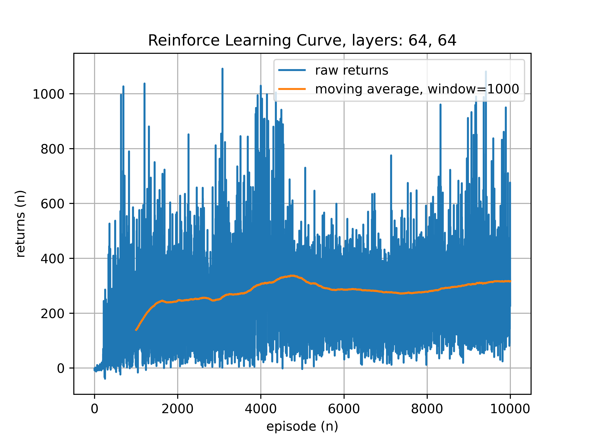
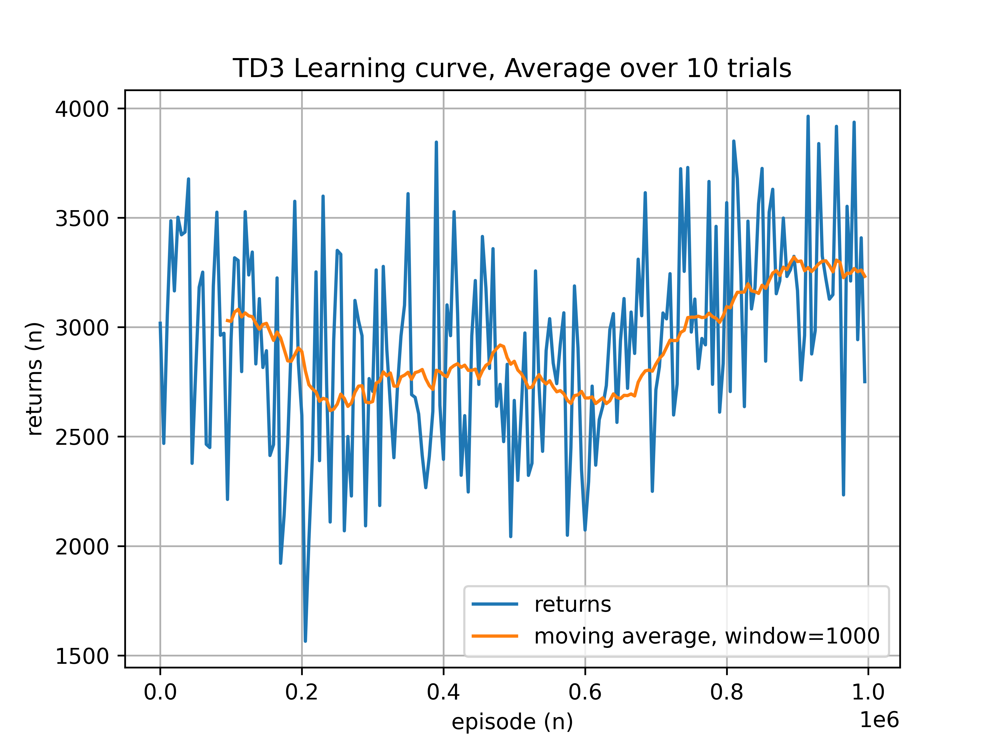
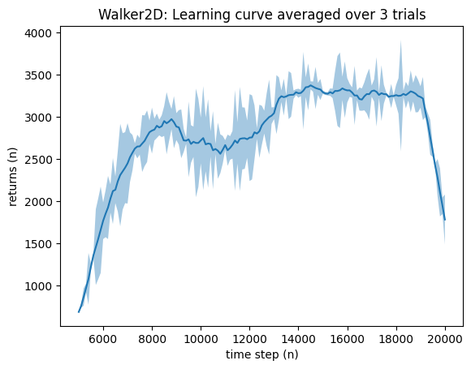

# Evaluation Results

discuss, evaluate and interpret the results with reference to the literature

outline the structure of the results chapter - one paragraph

the results shall show how the reserach question was met and answered

use plots and discuss the initial baseline REINFORCE evaluation results

During initial development of the REINFORCE implementation, the network comprised of a simpler structure of two hidden layers of 64 neurons. The raw episode returns were plotted over each episode and a simple moving average overlayed to identify a learning trend:

The learning curve shows high sample variance with a small upward trend, not exceeding an average return of ~300.

Increasing the size of the hidden layers to 128 neurons and the training duration, did not improve the performance of the model:

use plots and discuss the enhanced baseline REINFORCE policy evaluation results

As devevlopment progressed with the TD3 model. Methods were researched in an attempt to improve the performance and the training stability of REINFORCE; to add fairness to the A/B comparisons:

- The model complexity was increased to the final configuration of three hidden layers (see Methodology) (TODO cite research)
- Xavier initialisation was added to the mean and log-standard-deviation head layers. This attempts to match the variance of the output to the input. (TODO cite)
- Gradient clipping was used to prevent exploding gradients, preventing the loss function swinging between suboptimal solutions (TODO cite).
  - Experiementation showed large gradients (over ~5), leading to high variance in training stability.
  - This was applied to the standard deviation, limiting the size of the value function distributions. The mean distribution output is passed through a tanh activation layer, effectively clamping this output.

This plot follows the later structure of the training loop. Which averages the evaluations over 5 trials. A trial is a repetition (epoch) of the time steps.

The enhanced policy shows negligible improvements to the performance, with some improvement to training stability.

An observation to the REINFORCE learning curves, thus far, show that the rate of incremental learning is very slow and almost non-existent. This is due to the complexity of the continuous training environment. REINFORCE does not have the capacity to converge to a strong solution over a sufficient period of time. The reward returns achieved by the REINFORCE algorithm are not sufficient to achieve a walking solution.

TODO discuss learning rate tuning, CITE REINFORCE research.

use plots and discuss the initial TD3 results

Initial development and evaluation of the TD3 algorithm showed strong returns and provided a stable solution for a walking robot. The networks for the actor and critic follow a 256-256-128 hidden layer structure.

TODO A/B comparison plots

TODO plot and compare the TD3 algorithm with network complexity defined in the Fujimoto paper.

TODO further discuss the results of TD3 hyperparameter turning

TODO discuss limitations
Due to the long training times for both models, the number of trials was limited to 5, in order to capture multiple executions.
In TD3 towards the last quarter of the time steps, the gradients reach about 7, causing large jumps in average returns. Clamping to a maximum gradient of 5 should be considered for more stable extended training durations.

TODO discuss future research work and the potential performance gains - decision transformers and CITE the sourrces.

The results for the decision transformer were obtained from (TODO CITE: https://github.com/nikhilbarhate99/min-decision-transformer/tree/master/dt_runs) and show comparable behavioural policy scores to TD3. However, the time to reach a comparably robust solution is over 50 times faster. Taking 20,000 time steps compared to TD3's one million steps. 

TOOD refer to research to explain why this method is so much faster to reach a suitable solution.

TODO Table of results, comparing REINFORCE mean returns, mean S.D, time steps or number of updates, number of episodes.

