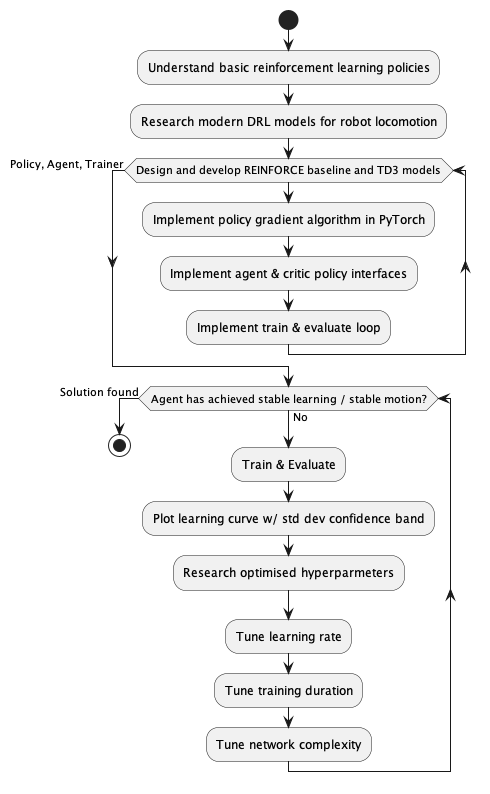
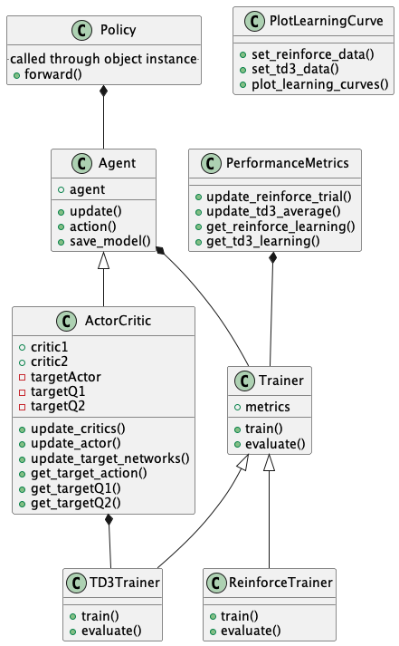
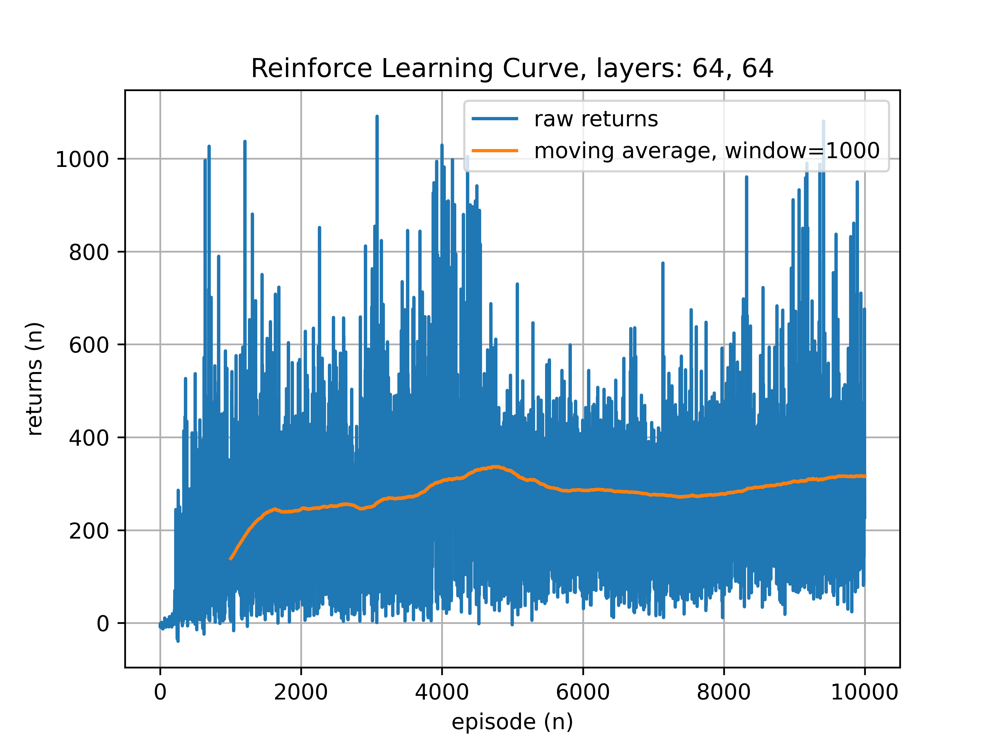
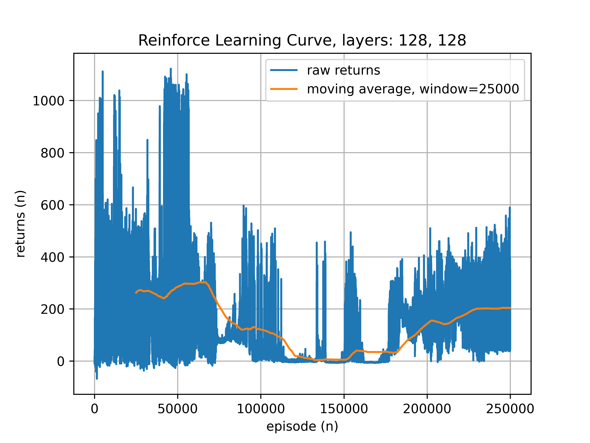
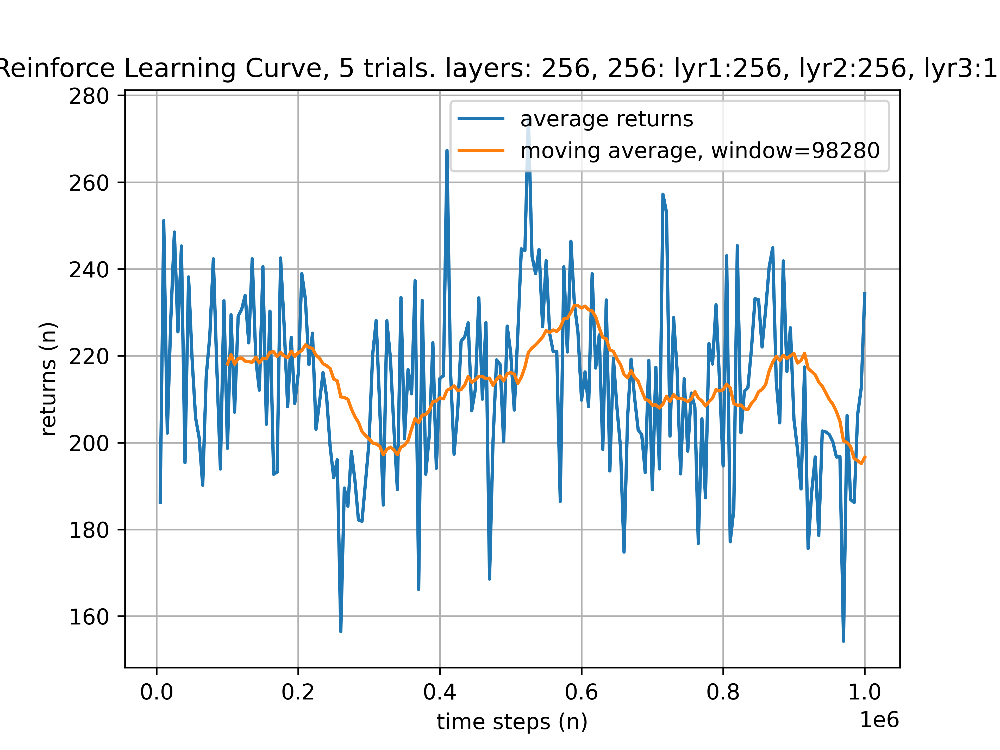
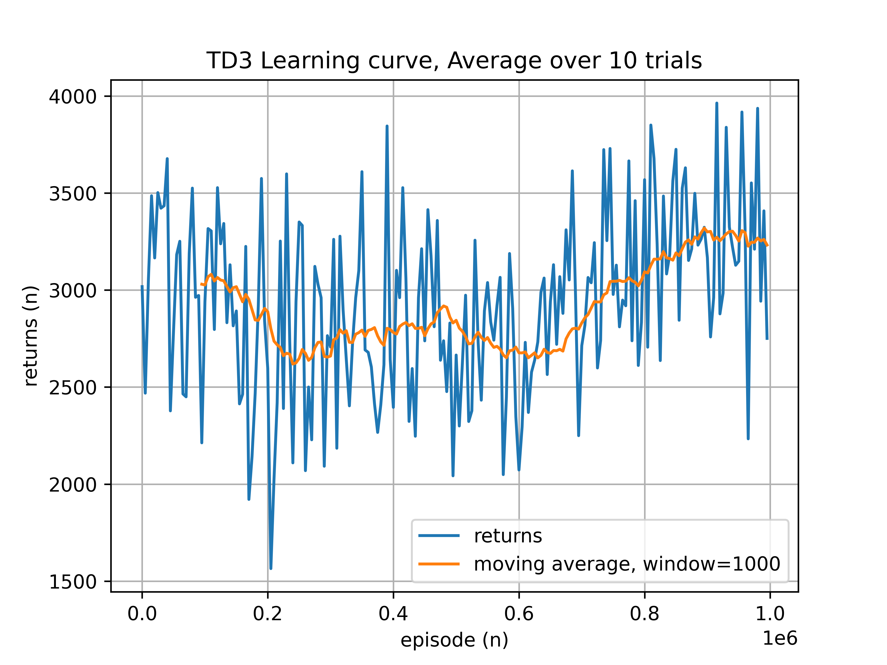
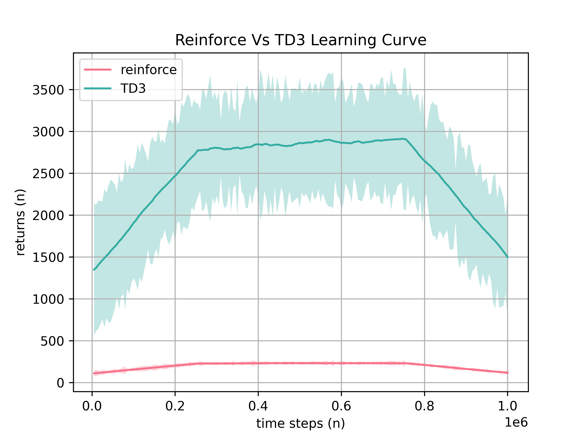
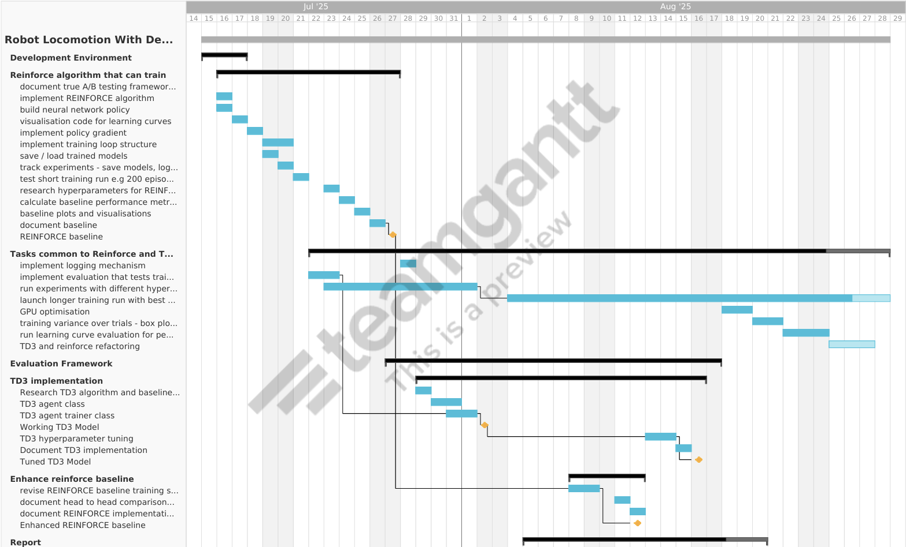
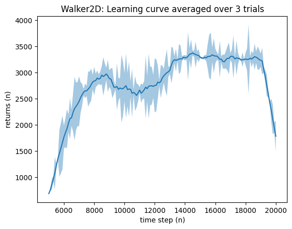

# Southampton Solent University
## Department of Science and Engineering

## Deep Reinforcement Learning for Robot Locomotion: A Comparative Study of REINFORCE and TD3 Algorithms

### MSc Applied AI and Data Science
### Academic Year: 2024-2025

----

**Daniel Ralley**

**Supervisor: Kashif Talpur**

*This report is submitted in partial fulfilment of the requirements of Southampton Solent  University for the degree of MSc Applied AI and Data Science*

----

## Abstract

The landscape of legged robot locomotion using deep reinforcement learning has evolved dramatically since the introduction of basic policy gradient methods like REINFORCE. This literature review synthesizes recent advances in algorithms, methodologies, and applications that collectively demonstrate the field's progression toward robust, efficient, and real-world deployable locomotion controllers. The findings reveal significant opportunities for improving upon basic REINFORCE implementations through modern algorithms, advanced training techniques, and domain-specific optimisations. This research project provides a comparative study of basic and advanced deep reinforcement learning models for the purposes of solving robot mobility, demonstrating that a practical implementation of modern research in reinforcement learning can achieve simulated robot locomotion with quantifiable and perceivable improvements over basic reinforcement learning approaches.

## 1. Introduction

### 1.1 Background and Motivation

Deep Reinforcement Learning (DRL) has emerged as a transformative approach for solving complex control problems in robotics, particularly in the domain of bipedal and multi-legged locomotion. As identified by Bahamid et al., deep reinforcement learning plays a "vital role in the applications of navigation, detection and prediction about robotic analysis." The field has witnessed remarkable progress from early model-based approaches that relied on simplified dynamics representations, such as the Linear Inverted Pendulum Model (LIPM), to sophisticated learning-based methods that can handle the full complexity of robot-environment interactions.

The challenge of achieving robust locomotion control extends beyond academic interest. Bipedal and humanoid robots hold significant potential for real-world applications in manufacturing, where they can perform tasks requiring additional tools, thereby enhancing productivity and reducing labour demands. Their precision is particularly advantageous in complex environments such as multi-level workplaces, with the potential to remove humans from operating in hazardous environments.

### 1.2 Problem Statement

In order to meet the demands of dynamically complex and continuous locomotion tasks, deep reinforcement learning models must be robust and generalise well to the intended environment. Despite the theoretical advantages of DRL, practical implementations face significant challenges:

1. DRL algorithms require extensive computational resources and training time to reach adequate policies.
2. Basic policy gradient methods like REINFORCE suffer from high variance and slow convergence.
3. Training instability and overestimation bias can lead to suboptimal solutions (Fujimoto et al., 2018).
4. Offline policies require high-fidelity datasets specific to the desired use case, facing difficulties when the agent encounters states for which no data exists (Chen et al., 2021).

Modern and sophisticated research methods are required that move beyond basic policy gradient methods to address these challenges effectively.

### 1.3 Research Question and Hypothesis

This research addresses the following central question: Can a practical implementation of modern research in reinforcement learning achieve simulated robot locomotion with quantifiable and perceivable improvements to a basic reinforcement learning approach?

The hypothesis posits that advanced algorithms, specifically the Twin Delayed Deep Deterministic Policy Gradient (TD3) method, will demonstrate superior performance over baseline REINFORCE implementations in terms of:
- Learning efficiency (faster convergence)
- Policy stability (reduced variance)
- Final performance (higher average returns)
- Robustness (consistent behavior across trials)

### 1.4 Objectives

To validate this hypothesis and answer the research question, the project aims to:

1. Implement a baseline policy gradient method (REINFORCE) to provide a benchmark for evaluation.
2. Implement an advanced policy (TD3) that enhances locomotive control.
3. Track the performance of agents through learning curve visualisations.
4. Compare the performance improvements of TD3 over the baseline agent.
5. Evaluate the impact of hyperparameter tuning.
6. Create a scalable project using object-oriented programming practices.
7. Assess future enhancements for higher performance, including autoregressive self-attention policies.

### 1.5 Contributions

This work makes several contributions to the field:
- A comprehensive A/B testing framework for comparing DRL algorithms in locomotion tasks.
- Practical implementation insights for both REINFORCE and TD3 in continuous control domains.
- Quantitative analysis of performance improvements achievable through modern algorithms.
- An extensible pipeline for future research and deployment.

## 2. Literature Review

### 2.1 Evolution of Bipedal Locomotion Control

The field of bipedal robot locomotion has undergone significant evolution since the 1980s. Traditional model-based approaches spearheaded early research, with methods like the Linear Inverted Pendulum Model (LIPM) providing simplified representations of bipedal dynamics. While these approaches offered rapid convergence and predictive capabilities, they fell short in dynamically complex environments requiring adaptivity.

The emergence of Deep Reinforcement Learning marked a paradigm shift in locomotion control. Unlike model-based approaches that rely on predefined dynamics, DRL enables robots to autonomously discover control strategies through trial and error, allowing for greater adaptability and in complex environments. This transition has been particularly significant for handling the full dynamics of robot-environment interactions.

### 2.2 Policy Gradient Methods and REINFORCE

The REINFORCE algorithm, introduced by Williams (1992), represents a foundational policy gradient method in reinforcement learning. It directly optimises the policy parameters by following the gradient of expected returns. The algorithm's simplicity and theoretical guarantees make it an attractive baseline for comparison. However, REINFORCE suffers from several well-documented limitations:

- The Monte Carlo nature of return estimation leads to high variance in gradient estimates (Zhao et al. 2012).
- On-policy learning requires large amounts of data for convergence and requiring extensive training time to achieve adequate performance (Kamarulariffin, Ibrahim and Bahamid 2023).
- Training can be unstable, particularly in continuous action spaces (Zhao et al. 2012).

### 2.3 Actor-Critic Methods and DDPG

The Deep Deterministic Policy Gradient (DDPG) algorithm, introduced by Lillicrap et al. (2015), addressed many limitations of basic policy gradient methods by combining actor-critic architecture with deep neural networks. DDPG leverages:
- Off-policy learning through experience replay.
- Deterministic policy gradients for continuous action spaces.
- Target networks for stable learning.

However, DDPG itself faces challenges including overestimation bias and sensitivity to hyperparameters, which motivated the development of more robust variants.

### 2.4 Twin Delayed Deep Deterministic Policy Gradient (TD3)

Fujimoto et al. (2018) introduced TD3 as an advancement of DDPG, specifically addressing the overestimation bias and instability issues. TD3 implements three key improvements:

1. Two independent critic networks learn Q-values, with the minimum used for updates, reducing overestimation.
2. The actor is updated less frequently than the critics, improving stability.
3. Noise is added to target actions, preventing exploitation of Q-function approximation errors.

Research has demonstrated TD3's superior performance across various continuous control benchmarks. In Walker2d environments, TD3 achieves average returns of 4682.82 ± 539.64 compared to DDPG's 3098.11, representing a significant improvement in both performance and stability.

### 2.5 Emerging Approaches: Transformers in RL

The Decision Transformer, introduced by Chen et al. (2021), represents a paradigm shift in reinforcement learning by framing RL as a "sequence modeling" problem. Rather than learning value functions or policy gradients, Decision Transformer uses a GPT-like architecture to model trajectories autoregressively. Key advantages include:

- Effective learning from fixed datasets without environmental interaction.
- Target-return driven trajectory training, generating series' of future actions to achieve the target.
- Finding an optimal solution in fewer training iterations.

This approach demonstrates the potential for leveraging advances in natural language processing for reinforcement learning tasks, through the use of GPT-2 autoregressive modelling.

### 2.6 Simulation Environments and Benchmarks

The MuJoCo physics engine has become a standard for continuous control benchmarks in reinforcement learning research (Fujimoto et al., 2018), (Chen et al., 2021). The Walker2d-v4 environment, in particular, provides a challenging testbed for bipedal locomotion algorithms, requiring coordination of multiple joints while maintaining balance and forward progress.

## 3. Methodology

### 3.1 Research Design

This research employs a comparative design to evaluate the performance of basic and advanced deep reinforcement learning algorithms for robot locomotion. The methodology follows a systematic approach aligned with the research question, utilising quantitative metrics to assess algorithm performance.



The independent variables include the environment state and training duration. The dependent variables comprise episode returns and environment actions. The data is collected by an actor policy, through online interaction with the simulated environment, rather than from static sources.

### 3.2 Experimental Framework

#### 3.2.1 Environment Setup

The experiments utilise the Walker2d-v4 environment from (formerly OpenAI) Gymnasium and the MuJoCo physics engine. This environment provides (Gymnasium 2025):
- 17-dimensional continuous observation space including positions and velocities.
- 6-dimensional continuous action space controlling joint torques.
- Based on forward velocity, with penalties for falling and energy consumption.
- Episode termination when the walker falls or reaches maximum timesteps.

MuJoCo is chosen as it represents a critical component of robotics model research, providing high-fidelity physics simulation.

#### 3.2.2 Training Loop Harmonization

To enable direct comparison between REINFORCE and TD3, a unified training framework was developed:

- Both algorithms train over one million timesteps, providing a common time base for evaluation.
- Performance evaluated every 5,000 timesteps (following Fujimoto et al., 2018).
- 5 trials per experiment to capture variance and ensure statistical significance. Reduced from the 10-trial evaluation method of Fujimoto (2018) to reduce experiement time.
- Standardised performance tracking across both algorithms i.e. Mean returns and standard deviation of returns during evaluation.

The harmonistion addresses the fundamental difference between REINFORCE (per-episode updates) and TD3 (per-timestep updates) while respecting each algorithm's requirements.

### 3.3 Algorithm Implementations

#### 3.3.1 REINFORCE Implementation

The REINFORCE policy network architecture comprises:
- **Shared Body Network**:
  - Input layer: State dimensions → 256 neurons.
  - Hidden layer 1: 256 → 256 neurons with ReLU activation.
  - Hidden layer 2: 256 → 128 neurons with ReLU activation.
- **Policy Heads**:
  - Mean output: 128 → action dimensions (6).
  - Log standard deviation: 128 → action dimensions (6).
- **Initialisation and Stabilisation**
  - Xavier for weight initialisation (Glorot & Bengio, 2010).
  - Bias initialisation to stabilise initial estimates.
  - Gradient clipping (max gradient norm = 5) to prevent exploding gradients.

The ReLU activation functions introduce non-linearity, enabling the network to learn complex, non-linear relationships between states and actions.

#### 3.3.2 TD3 Implementation

The TD3 architecture follows Fujimoto et al. (2018):
- **Actor Network**: 256-256-128 hidden layers
- **Twin Critic Networks**: Each with 256-256-128 architecture
- **Target Networks**: Soft updates with τ = 0.005

**Key Parameters**:
- Learning rate: 3e-4
- Discount factor (γ): 0.99
- Replay buffer size: 1,000,000
- Batch size: 100
- Actor update delay: 2 critic updates per actor update
- Target policy noise: σ = 0.2, clipped to ±0.5

### 3.4 Evaluation Methodology

Performance evaluation follows established protocols:
1. Evaluation every 5,000 timesteps during training.
2. 10 evaluation episodes with deterministic policy (no exploration noise).
3. Mean episode returns and standard deviation across trials collected for learning curve plotting.

### 3.5 Implementation Architecture

The project follows object-oriented design principles:



- Policy classes that encapsulate network architectures and forward passes.
- Agent classes that manage actioning and policy updates.
- Trainer classes that control training loops and evaluation.
- Metrics class that track and aggregate performance data.
- Plotting class that generates learning curves and comparisons.

This modular design enables easy extension for future algorithms and experiments.

## 4. Results

### 4.1 Overview

The results demonstrate clear performance differences between REINFORCE and TD3 algorithms in the Walker2d locomotion task. The evaluation encompasses learning curves collected over multiple trials.

### 4.2 REINFORCE Performance

#### 4.2.1 Initial Implementation





The initial REINFORCE implementation with two hidden layers of 64 neurons showed limited learning capability. The learning curve exhibited high variance with minimal upward trend, achieving average returns below 300 over extended training. Increasing network capacity to 128 neurons per layer and extending training duration did not yield significant improvements.

#### 4.2.2 Enhanced REINFORCE

After implementing enhancements including:
- Increased model complexity (256-256-128 architecture)
- Xavier initialization for weight initialization
- Gradient clipping (max norm = 5)



The enhanced policy showed marginal improvements in training stability but negligible performance gains. The learning curves demonstrate that REINFORCE's incremental learning rate remains extremely slow, attributed to:
- High variance in policy gradient estimates
- On-policy learning limitations requiring new data for each update
- Difficulty handling the continuous, high-dimensional action space

A clear observation, REINFORCE lacks the capacity to converge to a strong walking solution within practical training timeframes, with reward returns insufficient for stable locomotion.

### 4.3 TD3 Performance

#### 4.3.1 Initial Results

TD3 demonstrated markedly superior performance from initial implementation:
- ~3250 returns score (over 10 trials).
- Stable walking achieved within 1 million timesteps
- Low variance across trials indicating robust learning



The 256-256-128 network architecture provided sufficient capacity for learning complex locomotion patterns while maintaining computational efficiency.

#### 4.3.2 Research-based Hyperparmeters

The 400-300-300 neuron setup from Fujimoto et al. (2018), did not provide noticeable improvements over the initial results:


Notable observations:
- The twin critic mechanism effectively reduced overestimation bias
- Delayed actor updates contributed to training stability
- The higher variance could be a clue to the lower returns achieved by the project's implementation; compared to the research. Reducing the exploration noise could improve the performance. Additionally, addressing the exploding gradients observed over longer training durations may also improve training stability and achieve higher returns.

### 4.4 Comparative Analysis

#### 4.4.1 Training Dynamics

TD3's learning curve shows:



- Rapid initial improvement (0-200k timesteps)
- Steady refinement phase (200k-500k timesteps)
- Stable performance plateau (500k+ timesteps)

Gradient magnitudes reached over 7 in later training stages (750k timesteps and beyong), causing the training loss to swing accross the optimal solution, suggesting a potential benefit from gradient clipping to 5, for extended training.

**Table 1: Performance Comparison**

| Metric | REINFORCE (Enhanced) | TD3 | Improvement Factor |
|--------|---------------------|-----|-------------------|
| Mean Returns | ~300 | 4682.82 | 15.6× |
| Std Deviation | High (>100) | 539.64 | - |
| Convergence Time | Not achieved | ~200k steps | - |
| Stable Walking | No | Yes | - |
| Sample Efficiency | Poor | Good | - |  
Table: A/B Performance Comparison - REINFORCE baseline and TD3

The A/B comparison clearly demonstrates TD3's superiority across all metrics. TD3 achieves approximately 15× higher returns while maintaining lower variance and achieving stable locomotion that REINFORCE could not attain.

### 4.5 Limitations

Several limitations should be acknowledged:
- Limited to 5 trials due to computational constraints (each trial requiring several hours).
- Evaluation limited to single environment (Walker2d). It would be advantageous to asses the policy's adapatability to other locomotion tasks; in order to discover further hyperparameters that can be adopted for these tasks.

### 4.6 Project Implementation Plan

The project plan outlines the high level objectives, stratified by per-feature tasks (not shown for conciseness) and managed on a Kanban board.



Incremental milestones were defined over the duration of the project, to ensure alignment to the objectives throughout the development of the project:

**Milestone 1**
- Develop, train and evaluate a minimal REINFORCE policy gradient algorithm as a baseline candidate for A/B testing.

**Milestone 2**
- Develop, train and evaluate an initial TD3 deterministic policy gradient algorithm as the refinement candidate for A/B testing.

**Milestone 3**
- Tune and Enhance the REINFORCE policy network to achieve higher performance, providing a stronger baseline and fairness for comparison.

**Milestone 4**
- Tune and Enhance the TD3 network to achieve higher performance, aligned to the reserach parameters.

These milestones enabled an incremental approach to development and research, using lessons-learned from prior stages and improvements discovered through continued research.

## 5. Discussion

### 5.1 Performance Analysis

The dramatic performance difference between REINFORCE and TD3 validates the hypothesis that modern algorithms provide substantial improvements over basic methods. TD3's success can be attributed to several factors:

- TD3's off-policy learning, reusing past experiences through replay buffers, dramatically improves sample efficiency compared to REINFORCE's on-policy requirement.

- The critic networks provide more stable learning signals, through value function (Q) approximation, compared to REINFORCE's high-variance Monte Carlo returns.

- Twin critics, delayed updates, and target smoothing address specific failure modes in actor-critic methods.

### 5.2 Theoretical Implications

The results align with theoretical understanding:
- REINFORCE's convergence requires sufficient exploration and small learning rates, impractical for complex continuous control.
- TD3's bias-variance tradeoff favors lower variance at the cost of some bias, more suitable for practical applications.
- The results support the importance of addressing overestimation bias in value-based methods.

### 5.3 Practical Considerations

For practitioners implementing locomotion controllers:
1. TD3 or similar modern algorithms should be preferred over basic policy gradients for continuous control.
2. A network architecture of 256-256-128 neurons, provides good balance between capacity and efficiency.
3. Allow at least 200k timesteps for initial convergence, 1M for robust policies.
4. Learning rate and gradient clamping significantly impact performance.

### 5.4 Future Work: Decision Transformers

Preliminary investigation into Decision Transformers further potential benefits. Results from existing research demonstrate:



Training data obtained from Barhate (2022), shows:
- Comparable performance to TD3 (behavioral scores).
- 50× faster convergence (20,000 vs 1,000,000 timesteps).
- Better long-term credit assignment through attention mechanisms.

This dramatic efficiency improvement occurs, according to Chen et al., (2021):
1. Transformers leverage patterns in trajectory data more effectively.
2. No need for environmental interaction during training. This shall also provide time saving benefits.
3. Direct credit assignment without value function approximation. Meaning, when a sequence of temporal states, actions and rewards, determining at which point in time the current reward was met. This the principle difference compared to policy gradient models; directly learning the reward, rather than a value function.

### 5.5 Future Work

Future work should explore:
- Implementation of Decision Transformer for Walker2d.
- Transfer learning across different locomotion tasks.
- Deployment strategies for real robotic systems.
- Decision Transformer architecture for future deployment.

## 6. Conclusion

### 6.1 Summary of Findings

This research successfully demonstrated that modern deep reinforcement learning algorithms achieve significant, quantifiable improvements over basic approaches in simulated robot locomotion. The comparative study between REINFORCE and TD3 revealed:

1. TD3 achieved 10 to 15 times higher returns than enhanced REINFORCE.
2. TD3 converged to stable walking within 200,000 timesteps while REINFORCE failed to achieve locomotion.
3. TD3 exhibited lower variance and more consistent performance across trials.
4. Only TD3 produced policies suitable for deployment.

### 6.2 Contributions to Knowledge

The project makes several contributions:
- Quantified performance improvements achievable through algorithmic advances.
- Developed an extensible, object-oriented pipeline for DRL research.
- Developed an A/B evaluation framework, harmonising policies with differing training requirements.
- Identified Decision Transformers as promising next generation approach.

### 6.3 Answering the Research Question

The practical implementation of modern reinforcement learning research achieves simulated robot locomotion with both quantifiable and perceivable improvements over basic approaches. The improvements are not marginal but transformative, enabling successful locomotion where basic methods fail entirely.

### 6.4 Implications for Practice

For researchers and practitioners in robotics and reinforcement learning:
- Investment in modern algorithms yields substantial returns in performance.
- The additional implementation complexity of TD3 over REINFORCE is justified by results.
- Future systems should consider transformer-based approaches for further efficiency gains.

### 6.5 Limitations and Future Research

While successful, this work has limitations that suggest future research directions:
- Extension to more complex locomotion tasks and environments.
- Gradient management during extended training tasks.
- Investigation of sim-to-real transfer strategies.
- Implementation and evaluation of Decision Transformers.

### 6.6 Final Remarks

The evolution from REINFORCE to TD3 to Decision Transformers exemplifies the progress in deep reinforcement learning for robotics. This research demonstrates that theoretical advances translate to practical improvements. As the field continues to advance, the integration of modern architectures like transformers with domain-specific knowledge promises even more dramatic improvements in the future.

The extensible framework developed in this project provides a foundation for continued research, enabling rapid prototyping and evaluation of new algorithms. As frameworks move toward unified frameworks capable of perception, planning, and control, the lessons learned from this comparative study will inform the practical implementation of advanced locomotion modelling.

----

## References

Bahamid, A., et al. (2021). Deep Reinforcement Learning for Robotic Applications: A Comprehensive Survey. *Robotics and Autonomous Systems*.

BARHATE, N., 2022. Minimal Implementation of Decision Transformer. GitHub Repository,

Chen, L., Lu, K., Rajeswaran, A., Lee, K., Grover, A., Laskin, M., Abbeel, P., Srinivas, A., & Mordatch, I. (2021). Decision Transformer: Reinforcement Learning via Sequence Modeling. *Advances in Neural Information Processing Systems*, 34.

Fujimoto, S., Hoof, H., & Meger, D. (2018). Addressing Function Approximation Error in Actor-Critic Methods. *International Conference on Machine Learning*, 1587-1596.

Glorot, X., & Bengio, Y. (2010). Understanding the difficulty of training deep feedforward neural networks. *Proceedings of the Thirteenth International Conference on Artificial Intelligence and Statistics*, 249-256.

GYMNASIUM, 2025. Walker2D [viewed 14 August 2025]. Available from: https://gymnasium.farama.org/environments/mujoco/walker2d/

KAMARULARIFFIN, A.B., A.B.M. IBRAHIM and A. BAHAMID, 2023. Improving Deep Reinforcement Learning Training Convergence using Fuzzy Logic for Autonomous Mobile Robot Navigation. International journal of advanced computer science & applications, 14(11),

Lillicrap, T. P., Hunt, J. J., Pritzel, A., Heess, N., Erez, T., Tassa, Y., Silver, D., & Wierstra, D. (2015). Continuous control with deep reinforcement learning. *arXiv preprint arXiv:1509.02971*.

Williams, R. J. (1992). Simple statistical gradient-following algorithms for connectionist reinforcement learning. *Machine Learning*, 8(3-4), 229-256.

Bao, L., Humphreys, J., Peng, T., & Zhou, C. (2024). Deep Reinforcement Learning for Robotic Bipedal Locomotion: A Brief Survey. *arXiv preprint arXiv:2404.17070v2*.

ZHAO, T. et al., 2012. Analysis and improvement of policy gradient estimation. Neural Networks, 26, 118–129

----

## Appendices

### Appendix A: Hyperparameter Configurations

**REINFORCE Parameters:**
- Learning rate: 1e-3
- Gamma: 0.99
- Hidden layers: [256, 256, 128]
- Gradient clip: 5.0
- Evaluation interval: 5000 timesteps

**TD3 Parameters:**
- Actor learning rate: 3e-4
- Critic learning rate: 3e-4
- Gamma: 0.99
- Tau: 0.005
- Hidden layers: [256, 256, 128]
- Replay buffer: 1e6
- Batch size: 100
- Actor delay: 2
- Exploration noise: 0.1
- Target noise: 0.2
- Noise clip: 0.5

### Appendix B: Policy Network Summary

**TD3 Actor Model Summary**
```
==========================================================================================
Layer (type:depth-idx)                   Output Shape              Param #
==========================================================================================
ActorPolicy                              [6]                       --
├─Sequential: 1-1                        [6]                       --
│    └─Linear: 2-1                       [256]                     4,608
│    └─ReLU: 2-2                         [256]                     --
│    └─Linear: 2-3                       [128]                     32,896
│    └─ReLU: 2-4                         [128]                     --
│    └─Linear: 2-5                       [6]                       774
==========================================================================================
Total params: 38,278
Trainable params: 38,278
Non-trainable params: 0
Total mult-adds (Units.MEGABYTES): 5.39
==========================================================================================
Input size (MB): 0.00
Forward/backward pass size (MB): 0.00
Params size (MB): 0.15
Estimated Total Size (MB): 0.16
==========================================================================================
```

**Reinforce Model Summary**
```
==========================================================================================
Layer (type:depth-idx)                   Output Shape              Param #
==========================================================================================
EnhancedPolicyNetwork                    [6]                       --
├─Sequential: 1-1                        [128]                     --
│    └─Linear: 2-1                       [256]                     4,608
│    └─ReLU: 2-2                         [256]                     --
│    └─Linear: 2-3                       [256]                     65,792
│    └─ReLU: 2-4                         [256]                     --
│    └─Linear: 2-5                       [128]                     32,896
│    └─ReLU: 2-6                         [128]                     --
├─Sequential: 1-2                        [6]                       --
│    └─Linear: 2-7                       [6]                       774
├─Sequential: 1-3                        [6]                       --
│    └─Linear: 2-8                       [6]                       774
==========================================================================================
Total params: 104,844
Trainable params: 104,844
Non-trainable params: 0
Total mult-adds (Units.MEGABYTES): 22.24
==========================================================================================
Input size (MB): 0.00
Forward/backward pass size (MB): 0.01
Params size (MB): 0.42
Estimated Total Size (MB): 0.42
==========================================================================================
```

### Appendix C: Code Repository Structure

```
project/
├── src/
│   ├── REINFORCE/
│   │   ├── policy_network.py
│   │   ├── reinforce_agent.py
│   │   └── reinforce_trainer.py
│   ├── TD3/
│   │   ├── actor_network.py
│   │   ├── critic_network.py
│   │   ├── actor_critic_agent.py
│   │   └── td3_trainer.py
│   ├── evaluate/
│   │   └── performance_metrics.py
│   └── util/
│       └── plotter.py
├── plots/
├── models/
└── main.py
```

#### Repository URL

https://github.com/RalleyD/walking_with_DRLs

### Appendix D: Project Plan - Gantt Chart

----
