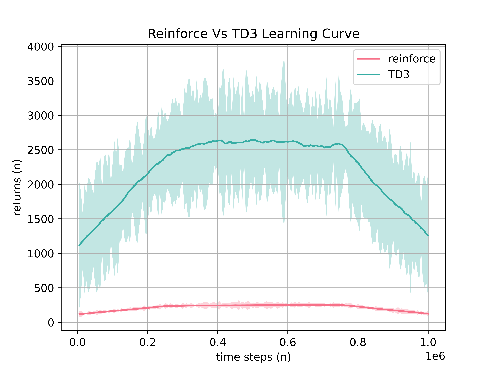
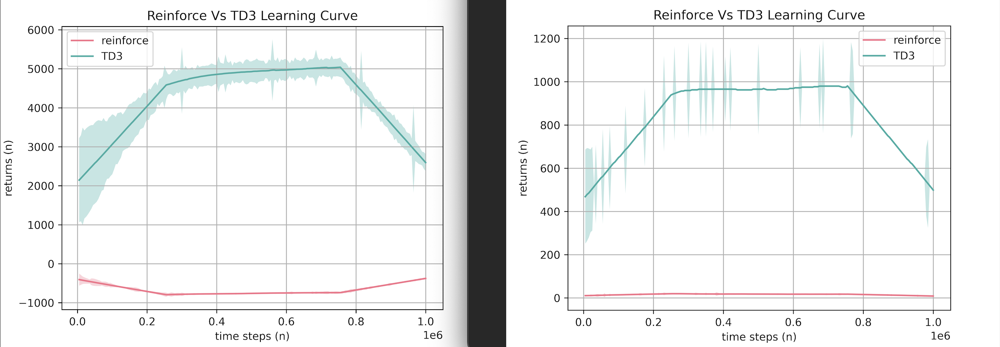
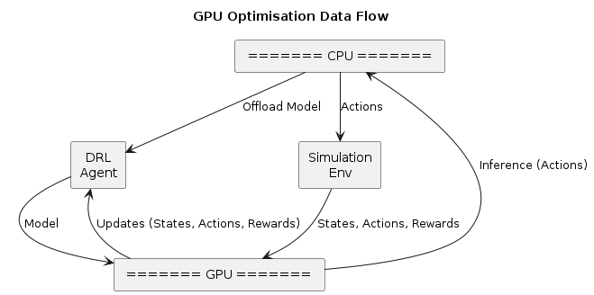
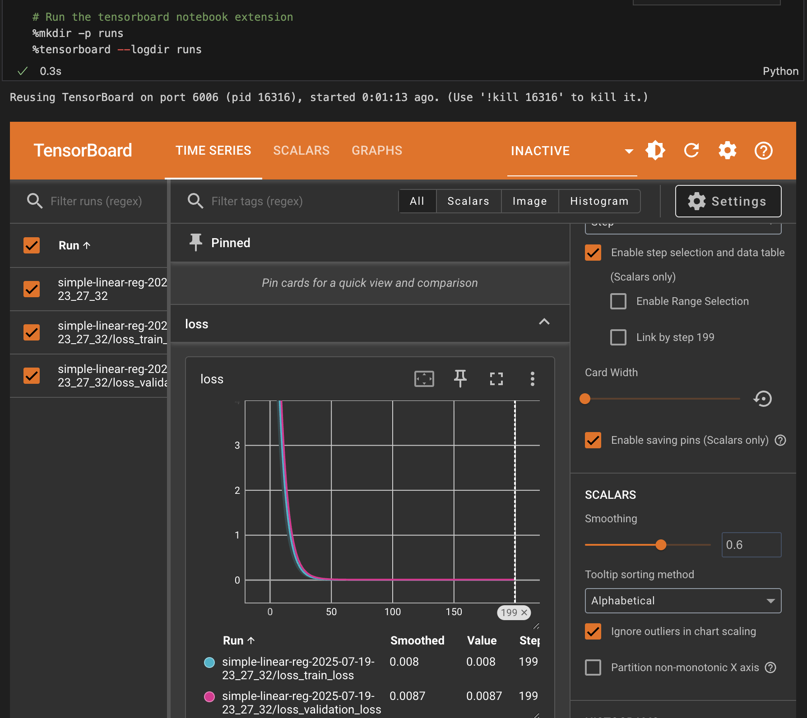

# Southampton Solent University
## Department of Science and Engineering

## Deep Reinforcement Learning for Robot Locomotion: A Comparative Study of REINFORCE and TD3 Algorithms

### MSc Applied AI and Data Science
### Academic Year: 2024-2025

----

**Daniel Ralley**

**Supervisor: Kashif Talpur**

*This report is submitted in partial fulfilment of the requirements of Southampton Solent  University for the degree of MSc Applied AI and Data Science*

----

## Abstract

The landscape of legged robot locomotion using deep reinforcement learning has evolved dramatically since the introduction of basic policy gradient methods like REINFORCE. This study synthesizes recent advances in algorithms, methodologies, and applications that collectively demonstrate the field's progression toward robust, efficient, and real-world deployable locomotion controllers. The findings reveal significant opportunities for improving upon basic REINFORCE implementations through modern algorithms, advanced training techniques, and domain-specific optimisations. This research project provides a comparative study of basic and advanced deep reinforcement learning models for the purposes of solving robot mobility, demonstrating that a practical implementation of modern research in reinforcement learning can achieve simulated robot locomotion with quantifiable and perceivable improvements over basic reinforcement learning approaches.

The study practically demonstrates the superiority of the TD3 algorithm over the REINFORCE algorithm. This is due to the twin-actor critic architecture and delayed deterministic policy update method, enabling higher training stability, lower sample variance and training error. Compared to the singular on-policy, per-episode and stochastic update method of REINFORCE. The study demonstrates, through research data, a more modern approach known as Decision Transformers which, demonstrate stronger performance by performing autoregressive modelling on the reward trajectory.

## 1. Introduction

### 1.1 Background and Motivation

Deep Reinforcement Learning (DRL) has emerged as a transformative approach for solving complex control problems in robotics, particularly in the domain of bipedal and multi-legged locomotion. As identified by Bahamid et al. (2023, p.935), deep reinforcement learning plays a "vital role in the applications of navigation, detection and prediction about robotic analysis." The field has witnessed remarkable progress from early model-based approaches that relied on simplified dynamics representations, such as the Linear Inverted Pendulum Model (LIPM), to sophisticated learning-based methods that can handle the full complexity of robot-environment interactions.

The challenge of achieving robust locomotion control extends beyond academic interest. Bipedal and humanoid robots hold significant potential for real-world applications in manufacturing, where they can perform tasks requiring additional tools, thereby enhancing productivity and reducing labour demands. Their precision is particularly advantageous in complex environments such as multi-level workplaces, with the potential to remove humans from operating in hazardous environments.

### 1.2 Problem Statement

In order to meet the demands of dynamically complex and continuous locomotion tasks, deep reinforcement learning models must be robust and generalise well to the intended environment. Despite the theoretical advantages of DRL, practical implementations face significant challenges:

1. DRL algorithms require extensive computational resources and training time to reach adequate policies.
2. Basic policy gradient methods like REINFORCE suffer from high variance and slow convergence.
3. Training instability and overestimation bias can lead to suboptimal solutions (Fujimoto et al., 2018).
4. Offline policies require high-fidelity datasets specific to the desired use case, facing difficulties when the agent encounters states for which no data exists (Chen et al., 2021).

Modern and sophisticated research methods are required that move beyond basic policy gradient methods to address these challenges effectively.

### 1.3 Research Question and Hypothesis

This research addresses the following central question: Can a practical implementation of modern research in reinforcement learning achieve simulated robot locomotion with quantifiable and perceivable improvements to a basic reinforcement learning approach?

The hypothesis posits that advanced algorithms, specifically the Twin Delayed Deep Deterministic Policy Gradient (TD3) method, will demonstrate superior performance over baseline REINFORCE implementations in terms of:
- Learning efficiency (faster convergence)
- Policy stability (reduced variance)
- Final performance (higher average returns)
- Robustness (consistent behavior across trials)

### 1.4 Objectives

To validate this hypothesis and answer the research question, the project aims to:

1. Implement a baseline policy gradient method (REINFORCE) to provide a benchmark for evaluation.
2. Implement an advanced policy (TD3) that enhances locomotive control.
3. Track the performance of agents through learning curve visualisations.
4. Compare the performance improvements of TD3 over the baseline agent.
5. Evaluate the impact of hyperparameter tuning.
6. Create a scalable project using object-oriented programming practices.
7. Assess future enhancements for higher performance, including autoregressive self-attention policies.

### 1.5 Contributions

This work makes the following contributions to the field:

- A comprehensive A/B testing framework for comparing DRL algorithms in locomotion tasks.
- Practical implementation insights for both REINFORCE and TD3 in continuous control domains.
- Quantitative analysis of performance improvements achievable through modern algorithms.
- An extensible pipeline for future research and deployment.

## 2. Literature Review

The field of bipedal robot locomotion has undergone significant evolution since the 1980s. Traditional model-based approaches spearheaded early research, with methods like the Linear Inverted Pendulum Model (LIPM) providing simplified representations of bipedal dynamics. While these approaches offered rapid convergence and predictive capabilities, they "fell short in dynamically complex environments requiring adaptivity" (Bao et al. 2025).

The emergence of Deep Reinforcement Learning marked a paradigm shift in locomotion control. Unlike model-based approaches that rely on predefined dynamics, DRL enables robots to autonomously discover control strategies through trial and error, allowing for greater adaptability and in complex environments. This transition has been particularly significant for handling the full dynamics of robot-environment interactions (Bao et al. 2025). 

The following literature presents the development of reinforcement learning from basic policy gradient algorithms, to deterministic methods, that aim to improve upon the limitations of prior deterministic policies. Further, the research investigated an offline approach. Providing a comprehensive review of methods, highlighting the distinct advantages in robot control.

### 2.2 Policy Gradient Methods and REINFORCE

The REINFORCE algorithm, introduced by Williams (1992), represents a foundational policy gradient method in reinforcement learning. It directly optimises the policy parameters by following the gradient of expected returns. The algorithm's simplicity and theoretical guarantees make it an attractive baseline for comparison. However, REINFORCE suffers from several well-documented limitations:

- The Monte Carlo nature of return estimation leads to high variance in gradient estimates (Zhao et al. 2012).
- On-policy learning requires large amounts of data for convergence and requiring extensive training time to achieve adequate performance (Kamarulariffin, Ibrahim and Bahamid 2023).
- Training can be unstable, particularly in continuous action spaces (Zhao et al. 2012).

### 2.3 Actor-Critic Methods and DDPG

The Deep Deterministic Policy Gradient (DDPG) algorithm, introduced by Lillicrap et al. (2015), addressed many limitations of basic policy gradient methods by combining actor-critic architecture with deep neural networks. DDPG leverages:

- Off-policy learning through experience replay.
- Deterministic policy gradients for continuous action spaces.
- Target networks for stable learning.

However, DDPG itself faces challenges including overestimation bias and sensitivity to hyperparameters, which motivated the development of more robust variants.

### 2.4 Twin Delayed Deep Deterministic Policy Gradient (TD3)

Fujimoto et al. (2018) introduced TD3 as an advancement of DDPG, specifically addressing the overestimation bias and instability issues. TD3 implements three key improvements:

1. Two independent critic networks learn Q-values, with the minimum used for updates, reducing overestimation.
2. The actor is updated less frequently than the critics, improving stability.
3. Noise is added to target actions, preventing exploitation of Q-function approximation errors.

Research has demonstrated TD3's superior performance across various continuous control benchmarks. In Walker2d environments, TD3 achieves average returns of 4682.82 ± 539.64 compared to DDPG's 3098.11 (Fujimoto et al., 2018), representing a significant improvement in both performance and stability.

Current research focuses on single-task optimisation i.e A singular aspect of walking, or balancing. Rather than developing unified controllers capable of seamless transitions between locomotion modes. As noted by Bao et al. (2025), the "ultimate goal" of achieving a unified framework capable of "handling locomotion tasks expected from future bipedal robots" remains unmet. Existing approaches require task-specific training and manual gait switching, limiting their practical applicability in dynamic real-world scenarios where robots must adaptively select appropriate locomotion strategies. 

### 2.5 Emerging Approaches: Transformers in RL

According to Bao et al. (2025), the "ultimate goal" is to achieve simulated to real-world transfer of robust models that can handle diverse tasks across different domains, without additional fine-tuning on the target hardware. Providing a "unified framework" capable of "handling locomotion tasks expected from future bipedal robots". This "zero-shot" potential capability, is highlighted in research into trajectory modelling using transformer architecture.

The Decision Transformer, introduced by Chen et al. (2021), represents a paradigm shift in reinforcement learning by framing RL as a "sequence modeling" problem. Rather than learning value functions or policy gradients, Decision Transformer uses a GPT-2 architecture to model trajectories autoregressively. While "zero-shot" generalisation is not explicitly achieved, decision transformers leverage an architecture that claims transfer with highly efficient convergence to robust solutions.

Key advantages include:

- Effective learning from fixed datasets without environmental interaction.
- Target-return driven trajectory training, generating series' of future actions to achieve the target.
- Finding an optimal solution in fewer training iterations.

This approach demonstrates the potential for leveraging advances in natural language processing for reinforcement learning tasks, through the use of GPT-2 autoregressive modelling.

### 2.6 Simulation Environments and Benchmarks

The MuJoCo physics engine has become a standard for continuous control benchmarks in reinforcement learning research (Fujimoto et al., 2018; Chen et al., 2021). The Walker2d-v4 environment in particular, provides a challenging testbed for bipedal locomotion algorithms, requiring coordination of multiple joints while maintaining balance and forward progress.

Bao et al. (2025) and Zhu et al. (2025), reinforce the widespread use of MuJoCo as a reliable means to train and evaluate reinforcement learning models; a comprehensive physics engine supporing robotics research and development. "Using full-order dynamics, which better represent the complex interactions robots face in the real world." (Bao et al. 2025).

### 2.7 Algorithmic Challenges

The fundamental challenges in value-based reinforcement learning stem from what Chen et al. (2021) has referenced, the "deadly triad" - the combination of function approximation, bootstrapping, and off-policy learning that can lead to divergent behavior. In actor-critic methods, function approximation errors compound through temporal difference learning, where "an estimate of the value function is updated using the estimate of a subsequent state," leading to an accumulation of error that can cause "arbitrarily bad states to be estimated as high value" (Fujimoto et al., 2018). This identifies the nature of boostrapping, learning directly from immediate experience (Stapelberg and Malan 2020) and directly contributes to overestimation bias.

Overestimation bias, "suboptimal actions might be highly-rated by the suboptimal critic, reinforcing the suboptimal action", caused by noisy values which is inherent due to innacuracies of the estimators; where learning critics actively feedback on the value of the learning actors' actions. Fujimoto et al. (2018), demonstrates that these issues persist in continuous control, showing that even initially zero-mean errors can propagate through the Bellman equation to create consistent overestimation bias, with their experiments (shown in their figure, 1b) revealing value overestimations exceeding 400 units in Walker2d environments.

Off-policy learning provides the potential to scale to more complex tasks by utilising exploration strategies, crtitic and target networks. However, this introduces training instability challenges related to high variance and slow convergence (Stapelberg and Malan 2020). Caused, but not limited to, target networks that remain too similar to the slow-changing policy, yielding little model improvement. If the policy estimates exhibit high variance, this contributes to unstable learning (Fujimoto et al. 2018).

These challenges results in the actor and critic in a feedback cycle where overestimation ocurrs due to a poor policy, affecting poor critic value estimates, leading to inaccruate target networks (Fujimoto et al. 2018).

### 2.8 Simulation to Real World Transfer

Despite the widespread use and fidelity advancements to simulation environments, such as MuJoCo, Bao et al. (2025) note that "a significant gap persists, exacerbated by the complexity and unpredictability of physical environments," with most methods still requiring real-world fine-tuning rather than achieving the ideal of zero-shot transfer where policies trained purely in simulation can be deployed without modification.

## 3. Methodology

The methodology follows an iterative, research-driven implementation. Focusing intially on the basic policy gradient method, an appropriate algorithm shall be implemented, following an extensible, object-oriented design that enables separation of responsibilities of the policy network, agent and training code. While, providing extensibility to more advanced algorithms. Following a baseline implementation that can be soley evaluated, a suitable advanced algorithm from the research shall be implemented; expanding on the baseline framework to perform A/B evaluation.

### 3.1 Research Design

This research employs a comparative design to evaluate the performance of basic and advanced deep reinforcement learning algorithms for robot locomotion. The methodology follows a systematic approach aligned with the research question, utilising quantitative metrics to assess algorithm performance.


The flow chart in figure 1 presents a high-level overview of the project stages.

- The research shall inform the design and implementation of the baseline and advanced DRL algorithms. 
- The agents for both the baseline and advanced algorithms shall be trained and evaluated via the training loop, repeated until a policy is learned whereby a simulated environment demonstrates both a quantifiable and percieveable locomotion.
- Suitable performance shall be quantified through the research i.e a suitable return score that equates to a robust solution. Perceivable performance shall be captured by means of environment recording; the simulation shall not terminate early due to a failure condition. 
- For each training iteration, either hyperparameters or the network complexity shall be adjusted; the performance monitored through learning curve plots and simulation recordings.

Further, the process shall evaluate both algorithms in different locomotion tasks. This demonstrates the advantages of an adaptable policy, by learning the dynamics of other environments. While, determining whether a simpler algorithm can solve a less-complex environment.

The agent collects data through online interaction with the environment, rather than static sources. The states and rewards collected, can be attributed to dependent variables; actions, being the independent variables. The states and rewards are directly influenced by the action taken. By taking actions through trial and error, the agent learns a policy which aims to maximise the long term reward (Stapelberg and Malan 2020). 

### 3.2 Experimental Framework

#### 3.2.1 Environment Setup

The experiments utilise the Walker2d-v4 environment from (formerly OpenAI) Gymnasium and the MuJoCo physics engine. This environment provides (Gymnasium 2025):

- 17-dimensional continuous observation space including positions and velocities.
- 6-dimensional continuous action space controlling joint torques.
- Based on forward velocity, with penalties for falling and energy consumption.
- Episode termination when the walker falls or reaches maximum timesteps.

MuJoCo is chosen as it represents a critical component of robotics model research, providing high-fidelity physics simulation.

#### 3.2.2 Training Loop Harmonisation

To enable direct comparison between REINFORCE and TD3, a unified training framework was developed:

- Both algorithms train over one million timesteps, providing a common time base for evaluation.
- Performance evaluated every 5,000 timesteps (following Fujimoto et al., 2018).
- 5 trials per experiment to capture variance and ensure statistical significance. Reduced from the 10-trial evaluation method of Fujimoto et al., (2018) to reduce experiement time.
- Standardised performance tracking across both algorithms i.e. mean returns and standard deviation of returns during evaluation.

The harmonisation addresses the fundamental difference between REINFORCE (per-episode updates) and TD3 (per-timestep updates) while respecting each algorithm's requirements.

```Python
def train(self):
    """
    Run the training loop
    """

    # ...

    for trial in range(self._n_trials):
        np.random.seed(trial)
        torch.manual_seed(trial)
        # start a new episode
        logger.info("Training trial: %d" % trial)
        done = False
        obs, _ = self._env.reset(seed=trial)
```  
Figure: Training Loop Reproducibility.

Figure _, demonstrates that in order to reproduce the training of both models, the environment state, environment versions and network shall be seeded to provide consistent and repeatable training randomisation. If single or multiple trials are run, the final result (averaged if multiple trials are used), results across separate training runs shall be comparable.

### 3.3 Algorithm Implementations

#### 3.3.1 REINFORCE Implementation

The REINFORCE policy network architecture comprises:

- **Shared Body Network**:

  - Input layer: State dimensions → 256 neurons.
  - Hidden layer 1: 256 → 256 neurons with ReLU activation.
  - Hidden layer 2: 256 → 128 neurons with ReLU activation.

- **Policy Heads**:

  - Mean output: 128 → action dimensions (6).
  - Log standard deviation: 128 → action dimensions (6).

- **Initialisation and Stabilisation**

  - Xavier for weight initialisation (Glorot & Bengio, 2010).
  - Bias initialisation to stabilise initial estimates.
  - Gradient clipping (max gradient norm = 5) to prevent exploding gradients.

The actor provides an interface for the training loop to action and update the policy. REINFORCE employs a stochastic gradient method, enabling exploration of the environment. Therefore the outputs are considered as a distribution of the mean for each joint action. When the agent performs a forward pass on the network, the means and standard deviations are converted to a gaussian distribution. The distributions are sampled, which provides the estimated action. From these distributions, the log of the probabilities of each action is summed, a measure of the agent's confidence in taking all estimated actions (Zhao et al. 2012).

```Python
def forward(self, x: torch.Tensor):
    """Given an observation, this function returns the means and standard deviations of
    the normal distributions from which the action components are sampled.

    Args:
        x (torch.Tensor): Observation from the environment
    Returns:
        means: Predicted means of the normal distributions
        stddevs: Predicted standard deviations of the normal distributions
    """
    shared_features = self.shared_net(x)

    # squashing the means with tanh to ensure they are in the range [-1, 1]
    means = torch.tanh(self.mean_net(shared_features))

    # if the log_std_net produces very negative values
    # then sigma, exp(log_std) becomes very small.
    # as a result the numerical stability drops and the log probs will lead to
    # unstable gradients
    # automatically clamp exp values prior to performing exp
    # thereby preventing extreme log values before the exp calculation
    stddevs = torch.clamp(
        self.log_std_net(shared_features),
        min=1e-6,  # Don't go negative
        max=10,   # experiment to find a good value. Relates to exploding gradients.
    )
    
    stddevs = torch.exp(stddevs)

    return means, stddevs   
```  
Figure: REINFORCE - Forward Pass Implementation.

To provide the standard deviations for the agent's gaussian policy - the amount of exploration in the distributions - the model's output is exponentiated. This ensures that the variance is always positive. Additionally, for a high negative output, the exploration is small and for a high positive output, the exporation is large (Zhao et al. 2012, p.119)

#### 3.3.2 TD3 Implementation

The TD3 architecture follows recommendations from Wan, Korenkevych and Zhu (2025):

- Actor Network: 256-256-128 hidden layers.
- Twin Critic Networks: 
  - Each with 256-256-128 architecture.
  - Linear, single output to estimate the Q-value.
- Target Networks: Soft updates with τ = 0.005.

**Key Parameters**:

- Learning rate: 3e-4.
- Discount factor (γ): 0.99.
- Replay buffer size: 1,000,000 (equivalent to the training steps).
- Batch size: 100.
- Actor update delay (d): 2 critic updates per actor update.
- Target policy noise: σ = 0.2, clipped to ±0.5.

TD3 leverages a Deterministic policy, rather than a stochasitc policy. The agent shall directly map states to actions; taking the same action for a given state. The policy takes action without uncertainty, meaning without a stochastic probability distribution. There are two forms of agent, an actor and a critic (Stapelberg and Malan 2020).

```Python
target_actions = self.agent.get_target_action(
                        next_states_tensor)

clipped_noise = torch.clamp(
    torch.rand_like(
        target_actions, dtype=torch.float32
        # see Fujimoto et al. Evaluation.
    ) * 0.2, -0.5, 0.5
)
```  
Figure: Clipped Gaussian Noise - TD3 Target Action

To aid convergence to a robust policy, gaussian noise is added to the target action, preventing the policy from being overly deterministic, the noise is clipped to keep the target close to the original action (Fujimoto et al, 2018).

```Python
action = self.agent.get_action(obs)

exploration_noise = torch.clamp(torch.randn_like(
    torch.tensor(action), dtype=torch.float32) * 0.1,
    -0.5, 0.5).numpy()

action = np.add(action, exploration_noise)
```  
Figure: Clipped Gaussian Noise - TD3 Actor Estimate

To encourage exploration, gaussian noise is added to the policy estimation (Wan, Korenkevych and Zhu 2025; Fujimoto, van Hoof and Meger 2018).

```Python
class CriticPolicy(nn.Module):
    def __init__(self, obs_dim, action_dim, device='cpu'):
        super().__init__()

        # define sequential model, without RELU on the output
        self.policy_net = nn.Sequential(
            nn.Linear(obs_dim + action_dim, 256),
            nn.ReLU(),
            nn.Linear(256, 128),
            nn.ReLU(),
            # the output is a Q value (prediction of value)
            nn.Linear(128, 1)
        ).to(device)
```  
Figure 2: Critic Network Implementation.

The critic learns a quality function from the actor's interactions with the environment i.e state, action, reward, next state. Outputting a quality value based on the actor's predicted action; estimating the return of a given state action pair. Therefore, the critic network is used to update actor to maximise the quality value, guiding the actor's learning of appropriate state-driven actions (Shen 2024).

```Python
class ActorPolicy(nn.Module):
    def __init__(self, obs_dim, action_dim, max_action=1.0, device='cpu'):
        super().__init__()

        self._max_action = torch.Tensor([max_action]).to(device)

        # define sequential model, without RELU on the output
        self.policy_net = nn.Sequential(
            nn.Linear(obs_dim, 256),
            nn.ReLU(),
            nn.Linear(256, 128),
            nn.ReLU(),
            nn.Linear(128, action_dim)
        ).to(device)
```  
Figure 2: TD3 Actor Policy Implementation. 

The role of the Actor therefore, is to estimate actions which achieve the highest quality value, learning an optimal policy. After a delayed period (d), the actor is updated based on the current learned experiences of the critic (Shen 2024).

Target actor and critic networks are initialised as copies of the main actor and critic networks. Guiding the main critics toward optimal action-value functions. Target networks provide training stability by gradually updating towards the parameters of the main actor and critic networks. After a delayed period (d), the target network parameters are updated with a fraction (τ) of the main network parameters. This "soft" update, provides a steady shift of the targets (Shen 2024), analogous to a slow moving target that is easier to reach as the training progresses.

The purpose of the delayed targets and actor network updates is to allow the main critic training time to converge more consistently, before the actor and targets are updated. This further increases training stability and smoothing actor convergence, reducing policy oscillations across the gradients (Shen 2024).

#### 3.3.3 Common Network Attributes

Research supported by Wan, Korenkevych and Zhu (2025) and Fujimoto et al, 2018, note the use of rectified linear unit activation functions between the hidden layers. Since a perceptron acts as a linear regression unit in this case, the activation function provides efficient non-linearity, essential for solving non-linear mappings between states and actions, encountered in complex control problems. ReLU, is also used in Decision Transformers (Chen et al., 2021), which is discussed in-theory as part of future enhancements in chapter 5.

For the output layers i.e, the mean action values in REINFORCE and the estimated actor actions in TD3, tanh activation is used to limit the outputs within the expected environment bounds (-1, 1).

```Python
def update_actor(self, states: torch.Tensor):
        states = states.to(self._device)
        actions = self.actor(states)
        states = states.to(self._device)

        actor_loss = -self.critic1(states, actions).mean()  # maximise Q value

        self.actor_optimizer.zero_grad()
        actor_loss.backward()
        total_grad_norm = 0

        self.actor_optimizer.step()
```  
Figure: Agent - Backpropagation Update Method (TD3).

Both models are based on gradient descent; the aim of minimising the loss for each subsequent backpropagation during training. The aim of REINFORCE and TD3, is to maximise the policy's cumulative reward and q-value, respectively. Therefore, the backpropagation of these models maximises these values by minimising negative loss values, creating gradient ascent (Zhao et al. 2012).

### 3.4 Evaluation Methodology

Performance evaluation follows established protocols (Fujimoto et al, 2018):
1. Evaluation every 5,000 timesteps during training.
2. 10 evaluation episodes with a deterministic policy (no exploration noise). Representative of how the model is tested in practice 
3. Mean episode returns and standard deviation across trials collected for learning curve plotting.

### 3.5 Implementation Architecture

The project follows object-oriented design principles, illustrated in figure 2:


The class diagram demonstrates a composition of dependencies, including:

- Policy classes that encapsulate network architectures and forward passes.
- Agent classes that manage actioning and policy updates.
- Trainer classes that control training loops and evaluation.
- Metrics class to track and aggregate performance data.
- Plotting class that generates learning curves and comparisons.

Using object composition, the trainer class instantiates the agent class for policy training and metrics for tracking the learning curve data.

This modular design enables extension for future algorithms and experiments.

## 4. Results

The results demonstrate clear performance differences between REINFORCE and TD3 algorithms in the Walker2d locomotion task. The evaluation encompasses learning curves collected over multiple trials.

### 4.2 REINFORCE Performance

#### 4.2.1 Initial Implementation

The initial REINFORCE implementation with two hidden layers of 64 neurons showed limited learning capability, illustrated in figures 3 and 4:


Increasing the model complexity and the training duration to 250,000 episodes, illustrated in Figure 4:


The learning curve plots in figures 3 and 4, present the acumulated returns for each eposide, demonstrating the training variance. Simple moving average is used to show the learning trend. High variance is exhbited with minimal upward trend, achieving average returns below 300 over extended training. Increasing network capacity to 128 neurons per layer and extending training duration did not yield significant improvements.

#### 4.2.2 Enhanced REINFORCE

Figure 5 presents the learning curve following implementing enhancements, including:

- Increased model complexity (256-256-128 architecture)
- Xavier initialisation for weight initialisation
- Gradient clipping (max norm = 5)
- intial bias set to zero.


The enhanced policy learning curve, in figure 5, presents the acumulated per-episode return and the training trend using a simple moving average. Note that, in this and later plots, the time base (x axis) refers to time steps and not episodes. This is due to the harmonisation of the training loop structure between REINFORCE and TD3. In the time-step domain, one million time steps equates to one thousand episodes. This is an approximation as the episode duration varies in steps with each training iteration.

The curve shows comparable training stability with negligible performance gains, compared to figure 4. The learning curves demonstrate that REINFORCE's incremental learning rate remains extremely slow, attributed to:

High variance in policy estimates. Typical of simplistic REINFORCE models, the stochasticity of the policy means that a random component is added to the gradient estimate at each episode step. Since the true probability distribution of the trajectory is unknown, an "empirical average" is taken:

```Python
loss = torch.tensor(0.0)
# take the negative because we need gradient ascent
for gt, log_prob in zip(action_rewards, log_probs):
    loss += -log_prob * gt

# to balance the different episode lengths, averange the loss.
loss = loss.mean()

# determine the gradients
# reset the gradient to prevent accumulation
self.optimizer.zero_grad()
loss.backward()
```  
Figure: Reinforce Agent Update Method

Which, sums the log of the probabilities of taking all actions in each step, multiplied by the discounted action rewards of that trajectory (episode). When these noisy gradients from multiple time steps within a trajectory are aggregated, this is the cause of the high variance. Over longer trajectories (training durations), the accumulation of this noise worsens the variance, as seen in figures 3 and 4 (Zhao et al. 2012). 

On-policy learning limitations, requiring new data for each update. REINFORCE has poor sample efficiency due the on-policy approach, collecting the discounted rewards from a single training episode. Prior experiences, are not reused (Bao et al. 2025).

```Python
# Mean output layer
self.mean_net = nn.Sequential(
    nn.Linear(self._final_hidden, action_dim)
)

# xavier initialisation (weights)
# this scales the weights so that the variance of the outputs matches the layer size
nn.init.xavier_uniform_(self.mean_net[-1].weight)

# Log of standard deviation output layer
self.log_std_net = nn.Sequential(
    nn.Linear(self._final_hidden, action_dim)
)

# xavier log std initialisation
nn.init.xavier_uniform_(self.log_std_net[-1].weight)

# log std final layer initial bias to 0
self.log_std_net[-1].bias.data.fill_(0.0)
```  
Figure: REINFORCE Policy Initialisation.

The REINFORCE policy initialisation did not improve the learning curve results, demonstrated in the continued high variance shown in figures 3 to 5. Bias initialisation attempts to moderate the amount of initial exploration proportional to the layers size, preventing vanishing or exploding gradients (Lunartech 2025). 

```math
exp(σ) = 1.0 
```
Where σ represents the log standard deviation at initialisation, zero (Bajaj Aayush 2025).

In both initialisation cases, where this may have helped to improve the policy's ability to find an initial scale in fewer training iterations, it does not stabilise the ongoing training instability.

A clear observation, the REINFORCE implementation lacks the capacity to converge to a strong walking solution within practical training timeframes, with reward returns insufficient for stable locomotion.

### 4.3 TD3 Performance

TD3 demonstrated markedly superior performance from initial implementation:

- ~3250 returns score (over 10 trials).
- Stable walking achieved within 1 million timesteps
- Low variance across trials indicating robust learning

#### 4.3.1 Initial Results

Utilising the parameters defined in the study from Wan, Korenkevych and Zhu (2025), showed strong performance for the desired use case.


Figure 6 presents the acumulated per-episode reward; demonstrating the training variance. Simple moving average is used to demonstrate the learning trend. The learning curve illustrated in figure 6 demonstrates that a 256-256-128 network architecture provided sufficient capacity for learning complex locomotion patterns. Yielding a stable solution within one million time steps and a model complexity comparable to the reinforce basline, demonstrates computational efficiency. Approximate returns of ~3250 indicates that the agent has learned robust solution; the simulation environment walks without failing.

In contrast to REINFORCE, the relative variance exhibited is similar. However, the policy improved in performance over longer training trajectories.

#### 4.3.2 Research-based Hyperparmeters

The 400-300-300 neuron setup from Fujimoto et al. (2018), did not provide noticeable improvements over the initial results:



The following notable observations, from figures 6 and 7, can be made:

- The twin critic mechanism effectively reduced overestimation bias.
- Delayed actor updates contributed to training stability.
- The higher variance could suggest the lower returns achieved by this project's implementation; compared to the research. Reducing the exploration noise could improve the performance. Additionally, addressing the exploding gradients observed over longer training durations may also improve training stability and achieve higher returns. Gradient clipping was not applied in accordance with the research (Fujimoto et al., 2018).

### 4.4 Comparative Analysis

The following section compares the learning curve characteristics of both models. Both model implementations are subjected to further simulated training tasks. Where, each model is completely retrained in all environments.

#### 4.4.1 Training Dynamics

The TD3 learning curve, illustrated in figure 8, shows:


- Rapid initial improvement (0-200k timesteps)
- Steady refinement phase (200k-500k timesteps)
- Stable performance plateau (500k+ timesteps)

The results align with experiments conducted by Shen (2024). Which also demonstrate a steady upward trend following a steep initial ascent.

Gradient magnitudes reached over 7 in later training stages (750k timesteps and beyond), causing the training loss to swing accross the optimal solution, suggesting a potential benefit from gradient clipping to 5, for extended training.

n.b. The standard deviations plotted and recorded in the table correspond to half a standard deviation, aligned with the evaluation method from Fujimoto, et al (2018).

#### 4.4.2 Cross-evaluation in Other Simulations

Both TD3 and Reinforce were compared in the 'Cheetah' and 'Inverted-Pendulum' environments. This provided confidence in the agent's ability to learn mechanisms of higher (Cheetah) and lower (Inverted Pendulum) complexity and to assess the relative performance improvement of TD3 over REINFORCE across tasks.
In following figure, the Cheetah simulation (left), almost identical results were achieved with the TD3 initial policy network and the policy network configuration from the research.



Figure 9 illustrates that, in both cases, TD3 was able to achieve returns sufficient for a stable solution, while REINFORCE was not. REINFORCE was able to balance the pendulum for a short period of time, ultimately leading to early termination, due to exceeding the vertical angle limit.

**Table 1: Performance Comparison**

| Agent | Environment | Mean Returns | Std Deviation | Convergence | Stable Solution |
|-------|-------------|--------------|---------------|-------------|-----------------|
| TD3 | Walker2D-v4 | ~2800         | ~600         | ~200k steps | Yes         |
| Reinforce | Walker2D-v4 | ~300    | ~100         | Not achieved | No        |
| TD3 | Cheetah-v4  | ~5000        | ~500          | ~200k steps | Yes             |
| Reinforce | Cheetah-v4 | ~(-700) | -             | Not achieved | No             |
| TD3 | InvertedPendulum-v4 | ~980 | ~300          | ~200k steps | Yes             |
| Reinforce | InvertedPendulum-v4 | ~30 | -         | Not achieved | No             |  
Table 1: Performance Evaluation Summary.

The A/B comparison results in table 1, demonstrates TD3's superiority. TD3 achieves a stable solution in every tested environment, with a consistent convergence time, achieving a solution REINFORCE could not attain.

### 4.5 Limitations

The evaluation of each model and in each simulation was limited to 5 trials due to computational constraints (each trial requiring several hours), differing from 10 trials in the research (Zhao et al. 2012; Fujimoto et al. 2018).
Training optimisation should be considered with regards to early stopping when a plateau is detected, indicating convergence.

## 5. Discussion

### 5.1 Performance Analysis

The dramatic performance difference between REINFORCE and TD3 validates the hypothesis that modern algorithms provide substantial improvements over basic methods. TD3's success can be attributed to several factors:

- TD3's off-policy learning, reusing past experiences through replay buffers, dramatically improves sample efficiency compared to REINFORCE's on-policy requirement (Bao et al. 2025).

- The critic networks provide more stable learning signals, through value function (Q) approximation (Shen 2024, p.151), compared to REINFORCE's high-variance Monte Carlo returns.

- REINFORCE learns directly after each episode, collecting environment rewards and action probabilities from each episode step, causing large variance in the estimate of gradient directions (Kargar 2019).

In the latter case, directly learning a control policy through gradient ascent, creates two scenarios both relating to training instability.

Firstly, the policy is updated regardless of strong or weak environment interactions, leading to training instability (observed in the flucuating returns between each episode, in figures 3 and 4). TD3, in contrast, uses a replay buffer of environment interactions for a pre-determined duration during training. In the event of temporal correlation between successive steps, randomly sampling the replay buffer can prevent large and volatile updates (Fujimoto et al., 2018).

Secondly, REINFORCE trains on-policy without a value function to critisise the policy's action selections. TD3 utilises an off-policy approach by training a critic network separately to learn the action-value (Q) function. Guiding the actor to update its policy from the critic's learned experience. In this latter form, the actor learns to select actions that aim to maximise the Q-value estimate provided by the critic (Shen 2024).

The stochasticity of REINFORCE inherently has large variance, incresaing over longer training trajectories. To address this, a baseline component can be added to the value function, which should reduce variance, improving convergence.

The optimal baseline that minimises the variance of the gradient estimator is given by:

```math

b = \frac{
\mathbb{E} \left[ R(h) \left\| \sum_{t=1}^{T} \nabla_\theta \log p(a_t | s_t, \theta) \right\|^2 \right]
}{
\mathbb{E} \left[ \left\| \sum_{t=1}^{T} \nabla_\theta \log p(a_t | s_t, \theta) \right\|^2 \right]
}


\\[1em]
\text{where:} \\
\quad R(h) \text{ is the expected return; the action-value function of the policy } \\
\quad \nabla_\theta \log p(a_t | s_t, \theta) \text{ is the gradient of the log-probability of action } a_t \text{ at state } s_t \\
\quad \sum_{t=1}^{T} \nabla_\theta \log p(a_t | s_t, \theta) \text{ is the total gradient over the trajectory} \\
\quad \left\| \cdot \right\|^2 \text{ denotes the squared Euclidean norm}
```
Figure: Optimial reinforce baseline (Zhao et al. 2012)

As shown in figure _, the baseline projects the return onto the gradient, scaling by the gradient magnitude. Where a baseline term is used, the reward signals are normalised, making the gradient updates more consistent and less erratic. However according to Zhao et al. (2012), the problem can still persist.

To address specific failure modes in actor-critic methods, TD3 enhances deterministic policy gradient methods further with twin critics, delayed updates, and target smoothing:

Overestimation bias, a property of Q-learning, where maximising a noisy actor-value estimate leads to "consistent overestimation" (Fujimoto et al., 2018). A poor value estimate will accumulate critic error, leading to a suboptimal policy. TD3 uses two critics during training, taking the minimum Q-value from the target critics, to update the main critics. This results in more stable learning, reducing bias with more accurate Q-value estimations (Shen 2024).

Overfitting, deterministic policies tend to overfit to narrow peaks in the critic's value estimte, increasing the variance of the target networks. Introducing a small amount of noise to the target policy (smoothing), approximates similar actions to have similar values. Clipping the noise, keeps the target close to the original action (Fujimoto et al., 2018). This encourages exploration, keeping the actor from being too deterministic, enabling the policy to converge to a robust solution (Shen 2024).

Training stability, by updating the actor policy less frequently, this allows the critic to converge more consistently between updates, reducing oscillations during policy updates. Analogous, to a teacher learning from experience, prior to updating the student, minmising the error before performing a policy update (Shen 2024).

### 5.2 Theoretical Implications

The results align with theoretical understanding:

- REINFORCE's convergence requires sufficient exploration and small learning rates, impractical for complex continuous control.
- TD3's bias-variance tradeoff favors lower variance at the cost of some bias, more suitable for practical applications.
- The results support the importance of addressing overestimation bias in value-based methods.

### 5.3 Practical Considerations

For practitioners implementing locomotion controllers:

1. TD3 or similar modern algorithms should be preferred over basic policy gradients for continuous control.
2. A network architecture of 256-256-128 neurons, provides good balance between capacity and efficiency.
3. Allow at least 200k timesteps for initial convergence, 1M for robust policies.
4. Learning rate and gradient clamping significantly impact performance.

With respect to simple policy gradient methods, during experimentation REINFORCE demonstrated sensitivity to hyperparameters, particularly the learning rate. Which, further required adjustment from the inital to enhanced network structure. This is aligned wwith the findings by Zhao et al. (2012), making the practical implementation nontrivial. TD3 thefore, becomes a more optimal choice for practical deployment as the experimentation time is significantly lower.

#### 5.3.1 GPU Optimisation

```
CPU:
2025-Aug-17 14:32:23,190:td3_trainer:train:INFO: Training trial: 0
2025-Aug-17 14:34:49,032:td3_trainer:train:INFO: Training trial: 1
2025-Aug-17 14:38:38,449:td3_trainer:train:INFO: Evaluating model - Time step: 1000 - Mean returns: 80.72

GPU:
2025-Aug-17 14:30:06,851:td3_trainer:train:INFO: Training trial: 0
2025-Aug-17 14:30:55,895:td3_trainer:train:INFO: Training trial: 1
2025-Aug-17 14:31:50,382:td3_trainer:train:INFO: Evaluating model - Time step: 1000 - Mean returns: 38.27

--- Epochs / timesteps ---
    1000
--- Trials ---
    2
```  
Figure: Log Extract - CPU vs GPU Optimisation

The figure above shows an extract of the logging module which captures timestamps across the duration of the training and evaluation runs. Meausred over 1000 time steps, incorporating GPU optimisation reduced the training time by 72.26 %. See annex F for hardware specifications. 

 


Figure __, outlines the flow of data required for GPU optimisation. Data shall be sent down to GPU RAM at the moment it is required, i.e. for inference and optimisation. Data shall be loaded back to the CPU for other tasks such as data manipulation and passing into the simulation environment.

#### 5.3.2 Actor Gradient-Clipping

The TD3 results showed reducing performing above 750,000 timesteps. This was found to be a symptom of exploding gradients over longer training trajectories:

```
2025-Aug-22 12:55:37,262:td3_trainer:train:INFO: total grad norm after 5000 time steps: 3.8083461089059374
2025-Aug-22 12:55:40,103:td3_trainer:train:INFO: Evaluating model - Time step: 910000 - Mean returns: 5757.01

2025-Aug-22 12:56:23,400:td3_trainer:train:INFO: total grad norm after 5000 time steps: 12.291866027507764
2025-Aug-22 12:56:27,881:td3_trainer:train:INFO: Evaluating model - Time step: 915000 - Mean returns: 5490.95

2025-Aug-22 12:57:08,933:td3_trainer:train:INFO: total grad norm after 5000 time steps: 3.4161311908561887
2025-Aug-22 12:57:12,099:td3_trainer:train:INFO: Evaluating model - Time step: 920000 - Mean returns: 5714.88

2025-Aug-22 12:57:55,220:td3_trainer:train:INFO: total grad norm after 5000 time steps: 8.078854200195888
2025-Aug-22 12:57:58,363:td3_trainer:train:INFO: Evaluating model - Time step: 925000 - Mean returns: 5520.13
```  
Figure: TD3 Log - Exploding Gradients Over Longer Trajectories.

The gradient updates increased to magnitudes from ~7 to over ~21 in some instances. While TD3 employs stabilisation methods - clipped double-Q learning to minimise the estimation of two critics and soft target updates - the implemenation doesn't apply any management of the updates to the actor itself. The actor losses are provided by one critic network, if the Q-value is overestimated, the gradient with respect to actions will be larger:

```math
\nabla_a Q^{\pi}(s, a)
```  
Figure: Gradient of the critic Q-value output for a given action (a) in state (s); used to update the actor policy.

This will directly increase the magnitude of the policy gradient used to update the actor. The scale of the Q-value estimates are directly linked to the magnitude of the updates to the actor (Shen 2024, p.152). The logs from the experiments suggest that clipping the gradient norm to 5 should stabilise this problem.

#### 5.3.3 Training Duration

```
2025-Aug-22 10:38:56,171:td3_trainer:train:INFO: Training trial: 3
2025-Aug-22 10:39:01,471:td3_trainer:train:INFO: Evaluating model - Time step: 5000 - Mean returns: 5503.41

2025-Aug-22 13:09:29,056:td3_trainer:train:INFO: Evaluating model - Time step: 1000000 - Mean returns: 5514.83
```  
Figure: Per-trial Training Duration - Log Extract.

The training duration for TD3 is considerably long. During the training phases of the project, each trial took approximately two hours and thirty minutes, with GPU optimisation. In order to close the gap between research methods and deployable models, the training time should be drastically reduced while achieving a robust policy.

### 5.4 Future Work: Decision Transformers

The REINFORCE and TD3 models experimented, use policy gradient updates and quality value functions respectively. Decision transformers directly estimate the future actions. This requires a different model architecture, feeding past states, actions and rewards into an embedding encoder and modelling future actions autoregressively to achieve the desired reward outcome, which has proven effective at modelling long sequences of data. Adopting a model-free, offline approach to learning continuous locomotion tasks.

To achieve this, a decision transformer models the joint distribution of the sequence of states, actions and rewards. The decision transformer leverages a GPT-2 model, taking the tokenised historical data to perform the autoregressive modelling.

The offline approach provides the benefit of learning from either other agents or real-world data. Where tasks can be solved without requiring the complexity of implementing simulations.

The research suggests that decision transformers can scale better than deep reinforcment learning models, generalising to tasks faster and with higher robustness.

The learning curve results in figure 10, present further potential benefits by using Decision Transformers for reinforcement learning:


Evaluation data in figure 10, obtained from Barhate (2022), shows:

- Comparable performance to TD3 (behavioral scores).
- 50× faster convergence (20,000 vs 1,000,000 timesteps).
- Better long-term credit assignment through attention mechanisms.
- The implementation follows the same network structure and hyperparmeters as recommended by Chen et al. (2021), by default.
- According to Barhate (2022), the variance should reduce as the training reaches saturation over longer training periods.

This dramatic efficiency improvement occurs, according to Chen et al., (2021) because:

1. Transformers leverage patterns in trajectory data more effectively.
2. No need for environmental interaction during training. This shall also provide time saving benefits.
3. Direct credit assignment without value function approximation. Meaning, when a sequence of temporal states, actions and rewards, are used to determine at which point in time the current reward was met. This the principle difference compared to policy gradient models; directly learning the reward trajectory, rather than a value function.

The tradeoff is a higher implementation complexity, compared to TD3, requiring (Beeching and Simonini 2022):

- Extracting and, in some cases preprocessing, the dataset.
- Parsing the data for evaluating the model.
- Extending the decision transformer class to include a loss function.

The benefit is that decision transformers can scale effectively. By leveraging GPT-2 (transformer), matured and stabilised through its use in various high-dimensional domains, it can generalise to multiple tasks with its ability to model long-term dependencies, avoiding the need to discount future rewards, leading to near-sighted behaviour (Chen et al. 2021).

#### 5.4.1 Data Quality and Preprocessing Requirements

Training machine learning models typically requires quality datasets, containing accurate and diverse data over a significant number of observations. In traditional reinforcement learning training, value overestimation and error propagation are inherent challenges. The challenge of model-free reinforcement learning is that the datasets are generated from other agents, which may be suboptimal for the task. A task that is continuous, is unlikely to have data representing all states for all actions.

Similar to having a high fidelity simulation environment, data from unknown sources or poorly trained agents can generate destructive biases, as the transformer model is "conditioned on desired returns" (Chen et al. 2021).

For continuous control tasks, including locomotion environments like HalfCheetah, Hopper, and Walker, datasets include (Chen et al. 2021):

- "Medium: 1 million timesteps from a policy achieving roughly one-third of an expert's score."
- "Medium-Replay: Replay buffer data from an agent trained to a medium policy's performance (25k-400k timesteps)."
- "Medium-Expert: 1 million timesteps from a medium policy concatenated with 1 million timesteps from an expert policy."

Decision trasnformers achieve policy maximisation by leveraging all trajectories in the dataset to improve generalisation, even if dissimilar from the target. This requires preprocessing, starting with batches of normalised data sequences.

- Trajectory representation, feeding the sum of subsequent rewards from an initial timestep, allows the model to generate actions based on future desired rewards.
- Trajectories, corresponding states and actions are tokenised using an embedding layer with a time step embedding added to each token. This 
- Padding all tokens to sequence length, due to training by batches of sequences.

This allows GPT-2 to model trajectories autogressively and enable prompting, where the tokenisation allows a return target to be defined by the user.

#### 5.4.2 Model Configuration

The model configuration recommended by Chen et al. (2021), is as follows:

- 3 network layers
- 1 attention head layer
- 128 embedding dimension
- ReLU activation
- Dropout layer rate: 0.1

Including, the following hyperparameters:

- Batch size: 64
- Sequence length: 20
- Learning rate: 1e-4
- Gradient norm clipping: 0.25
- Weight decay: 1e-4
- Model warmup for first (0.1 * time steps) steps i.e No learning rate decay.
- Training steps: 25e3 to 1e6, depending on the dataset used.

The additional embedding layers, decaying learning rate and larger model size contribute to the higher relative complexity than that of TD3. The larger model helps to model the distribution of returns (Chen et al. 2021).

#### 5.4.3 Computational Requirements

As a result of the higher model complexity, the full training duration from Chen et al. (2021), according to Beeching and Simonini (2022), takes around three hours. With the shorter training duration taking approximately 40 minutes.

### 5.5 Future Work

Future work should explore:

- Implementation of Decision Transformer for Walker2d.
- Deployment strategies for real robotic systems.
- Richer visualisations and tracking of model development progress with Tensorboard.

Tensorboard is a visualisation from Tensorflow, which also works with PyTorch. Tensorboard can track testing and evaluation data logged to a specific folder to keep track of model development progress via an interactive dashboard. By extracting specific log data, plots can be analysed offline and data from multiple logs can be overlayed on the same visualisation:



Figure _, demonstrates the basic usage. The SummaryWriter methods ```add_graph``` and ```add_scalers``` were used to send training and validation loss data to Tensorboard to plot the loss curves. This will aid productivity, inspecting logs and data from multiple logs over longer development cycles (TensorFlow 2023).

## 6. Conclusion

The study provided a comprehensive analysis of the research across three deep reinforcement learning algorithms, for the purpose of solving mulitple simulated robot mobility tasks. The study demonstrated a deployable framework with a practical implementation and comparison of REINFORCE and TD3, with a theoretical evaluation of Decision Transformers. Validating the research results and demonstrating that an actor-critic method, while more complex in code, is easier to initialise and tune for desired results. While decision transformers serve as a promising model for future experimentation.

### 6.1 Summary of Findings

This research successfully demonstrated that modern deep reinforcement learning algorithms achieve significant, quantifiable improvements over basic approaches in simulated robot locomotion. The comparative study between REINFORCE, TD3 and Decision Transformers, revealed:

1. TD3 achieved 10 to 15 times higher returns than enhanced REINFORCE.
2. TD3 converged to stable walking within 200,000 timesteps, across various MuJoCo environments, including Walker2D, HalfCheetah and Inverted Pendulum, while REINFORCE failed to achieve locomotion; demonstrating minimal upward trend in returns after extended training.
3. TD3 exhibited lower variance and more consistent performance across trials.
4. Only TD3 produced policies suitable for deployment.
5. Decision transformers showed 50 times faster convergence, with higher potential returns over longer trajectories, than TD3.

TD3 exhibited significantly more consistent performance across multiple trials, indicating a robust and reliable learning process. For example, in the Walker2D-v4 environment, TD3 achieved mean returns of ~2800 with a standard deviation of ~600, while REINFORCE managed only ~300 mean returns with a standard deviation of ~100.

While demonstrating behavioral scores comparable to TD3, Decision Transformers demonstrated 50 times faster convergence rate, achieving stable solutions in as few as 20,000 timesteps compared to TD3's 1,000,000 timesteps. Decision Transformers proved to be robust in scenarios requiring long-term credit assignment and in sparse or delayed reward settings, tasks where traditional TD-learning algorithms often struggle (Chen et al. 2021). Long term credit assignment refers to how credit for a result should be distributed amongst the sequence of actions and states that led to a given result. This problem is characterised in delayed reward settings (indicative of TD3), where an agent receives a reward further into the future. Bootstrapping (updating estimates with other estimates) and discounting future rewards, prioritising short-term rewards over long term gains (Chen et al. 2021, p.3). By using sequence modelling, Decision Transformers don't bootstrap for long-term credit assignment. Instead, directly assigning credit using self-attention, linking past events to future outcomes (Chen et al. 2021).

### 6.2 Contributions to Knowledge

The project makes several contributions:

- Quantified performance improvements achievable through algorithmic advances.
- Developed an extensible, object-oriented pipeline for DRL research.
- Developed an A/B evaluation framework, harmonising policies with differing training requirements.
- Identified Decision Transformers as promising next generation approach.

The study provided further empirical evidence of REINFORCE's inherent limitations, specifically its high variance in gradient estimates due to its Monte Carlo nature and poor sample efficiency stemming from its on-policy learning approach. These factors contribute to its slow and unstable convergence in complex continuous action space.

The work practically showcased how TD3's theoretical advancements—namely, its twin critic networks, delayed policy updates, and target policy smoothing—effectively address the persistent problems of overestimation bias and training instability inherent in actor-critic methods. This provides strong empirical grounding for these critical architectural and procedural enhancements.

The research emphasised Decision Transformer's novel approach of casting Reinforcement Learning as a conditional sequence modeling problem. This represents a fundamental departure from traditional DRL paradigms that rely on value functions or policy gradients. Decision Transformers instead leverage autoregressive modeling to generate actions conditioned on desired returns, effectively performing direct long-term credit assignment via self-attention. This offers a new perspective on solving RL problems, drawing on the scalability and generalisation capabilities of transformer architectures.

### 6.3 Answering the Research Question

The practical implementation of modern reinforcement learning research achieves simulated robot locomotion with both quantifiable and perceivable improvements over basic approaches. The improvements are not marginal but transformative, enabling successful locomotion where basic methods fail entirely. The research into understanding why the basic gradient policy method failed, discovered potential improvements that could be explored for more basic locomation tasks, in the form of a baseline component to reduce training instability. However, the tradeoff of marginal implementation complexity over minimal tuning, favours the adoption of TD3. This validation confirms the critical role of modern algorithmic innovations in overcoming the inherent challenges of complex continuous control tasks in robotics

### 6.4 Implications for Practice

For researchers and practitioners in robotics and reinforcement learning:

- Investment in modern algorithms yields substantial returns in performance.
- The additional implementation complexity of TD3 over REINFORCE is justified by results.
- Future systems should consider transformer-based approaches for further efficiency and potential performance gains.

Experimentation shows TD3, a hidden layer architecture of 256-256-128 neurons, utilising ReLU activation functions between hidden layers and Tanh activation for output layers, provides an effective balance of learning capacity and computational efficiency. Learning rate and gradient clamping are critical for performance. TD3 benefits from actor and critic learning rates around 3e-4.

Aim for at least 200,000 timesteps for initial convergence and 1 million timesteps for developing robust and deployable policies.

Implement gradient clipping (e.g., a maximum norm of 5 for TD3) to mitigate exploding gradients, particularly during extended training, which was observed as gradient magnitudes increasing significantly in later stages.

### 6.5 Limitations and Future Research

While successful, this work has limitations that suggest future research directions:

- The TD3 performance results are lower than the results from Fujimoto et al. (2018). Implementation improvements should be considered from Raffin Antonin et al (2021) 'Stable Baselines3' repository and further underpin the design rationale.
  - Lower peak returns of approximately 1800 and higher standard deviations suggests training instability.
- Gradient management during extended training tasks.
- Investigation of sim-to-real transfer strategies.
- Implementation and evaluation of Decision Transformers.

### 6.6 Final Remarks

The evolution from REINFORCE to TD3 to Decision Transformers exemplifies the progress in deep reinforcement learning for robotics. This research demonstrates that theoretical advances translate to practical improvements. As the field continues to advance, the integration of modern architectures like transformers with domain-specific knowledge present dramatic improvements to scalable models. With the potential for real-world applications through faster convergence to robust solutions.

The extensible framework developed in this project provides a foundation for continued research, enabling rapid prototyping and evaluation of new algorithms. As frameworks move toward unified frameworks capable of perception, planning, and control, the lessons learned from this comparative study will inform the practical implementation of advanced locomotion modelling.

----

## References

Bao, L., Humphreys, J., Peng, T., & Zhou, C. (2024). Deep Reinforcement Learning for Robotic Bipedal Locomotion: A Brief Survey. *arXiv preprint arXiv:2404.17070v2*.

BAJAJ AAYUSH, 2025. Understanding Gradient Clipping (and How It Can Fix Exploding Gradients Problem). In: Neptune Blog. 8 May Available from: https://neptune.ai/blog/understanding-gradient-clipping-and-how-it-can-fix-exploding-gradients-problem

BARHATE, N., 2022. Minimal Implementation of Decision Transformer. GitHub Repository,

BEECHING, E. and T. SIMONINI, 2022. Train your first Decision Transformer. In: Hugging Face. 8 September Available from: https://huggingface.co/blog/train-decision-transformers

Chen, L., Lu, K., Rajeswaran, A., Lee, K., Grover, A., Laskin, M., Abbeel, P., Srinivas, A., & Mordatch, I. (2021). Decision Transformer: Reinforcement Learning via Sequence Modeling. *Advances in Neural Information Processing Systems*, 34.

Fujimoto, S., Hoof, H., & Meger, D. (2018). Addressing Function Approximation Error in Actor-Critic Methods. *International Conference on Machine Learning*, 1587-1596.

Glorot, X., & Bengio, Y. (2010). Understanding the difficulty of training deep feedforward neural networks. *Proceedings of the Thirteenth International Conference on Artificial Intelligence and Statistics*, 249-256.

GYMNASIUM, 2025. Walker2D [viewed 14 August 2025]. Available from: https://gymnasium.farama.org/environments/mujoco/walker2d/

KARGAR, I., 2019. RL Series-REINFORCE. In: Medium. 10 November Available from: https://kargarisaac.medium.com/rl-series-reinforce-in-pytorch-98102f710c27

KAMARULARIFFIN, A.B., A.B.M. IBRAHIM and A. BAHAMID, 2023. Improving Deep Reinforcement Learning Training Convergence using Fuzzy Logic for Autonomous Mobile Robot Navigation. International journal of advanced computer science & applications, 14(11),

Lillicrap, T. P., Hunt, J. J., Pritzel, A., Heess, N., Erez, T., Tassa, Y., Silver, D., & Wierstra, D. (2015). Continuous control with deep reinforcement learning. *arXiv preprint arXiv:1509.02971*.

LUNARTECH, 2025. Mastering Xavier Initialization: Enhancing Neural Networks for Optimal Training. In: Lunartech Blog. January 18 Available from: https://www.lunartech.ai/blog/mastering-xavier-initialization-enhancing-neural-networks-for-optimal-training

SHEN, X., 2024. Comparison of DDPG and TD3 Algorithms in a Walker2D Scenario. Atlantis Press International BV, pp.148

STAPELBERG, B. and K.M. MALAN, 2020. A survey of benchmarking frameworks for reinforcement learning. South African Computer Journal, 32(2), 258–292

TENSORFLOW, 2023. Using TensorBoard in Notebooks [viewed 03 September 2025]. Available from: https://www.tensorflow.org/tensorboard/tensorboard_in_notebooks

WAN, Y., D. KORENKEVYCH and Z. ZHU, 2025. An Empirical Study of Deep Reinforcement Learning in Continuing Tasks.

Williams, R. J. (1992). Simple statistical gradient-following algorithms for connectionist reinforcement learning. *Machine Learning*, 8(3-4), 229-256.

ZHAO, T. et al., 2012. Analysis and improvement of policy gradient estimation. Neural Networks, 26, 118–129

----

## Appendices

### Appendix A: Hyperparameter Configurations

**REINFORCE Parameters:**
- Learning rate: 1e-3
- Gamma: 0.99
- Hidden layers: [256, 256, 128]
- Gradient clip: 5.0
- Evaluation interval: 5000 timesteps

**TD3 Parameters:**
- Actor learning rate: 3e-4
- Critic learning rate: 3e-4
- Gamma: 0.99
- Tau: 0.005
- Hidden layers: [256, 256, 128]
- Replay buffer: 1e6
- Batch size: 100
- Actor delay: 2
- Exploration noise: 0.1
- Target noise: 0.2
- Noise clip: 0.5

### Appendix B: Policy Network Summary

**TD3 Actor Model Summary**
```
==========================================================================================
Layer (type:depth-idx)                   Output Shape              Param #
==========================================================================================
ActorPolicy                              [6]                       --
├─Sequential: 1-1                        [6]                       --
│    └─Linear: 2-1                       [256]                     4,608
│    └─ReLU: 2-2                         [256]                     --
│    └─Linear: 2-3                       [128]                     32,896
│    └─ReLU: 2-4                         [128]                     --
│    └─Linear: 2-5                       [6]                       774
==========================================================================================
Total params: 38,278
Trainable params: 38,278
Non-trainable params: 0
Total mult-adds (Units.MEGABYTES): 5.39
==========================================================================================
Input size (MB): 0.00
Forward/backward pass size (MB): 0.00
Params size (MB): 0.15
Estimated Total Size (MB): 0.16
==========================================================================================
```

**Reinforce Model Summary**
```
==========================================================================================
Layer (type:depth-idx)                   Output Shape              Param #
==========================================================================================
EnhancedPolicyNetwork                    [6]                       --
├─Sequential: 1-1                        [128]                     --
│    └─Linear: 2-1                       [256]                     4,608
│    └─ReLU: 2-2                         [256]                     --
│    └─Linear: 2-3                       [256]                     65,792
│    └─ReLU: 2-4                         [256]                     --
│    └─Linear: 2-5                       [128]                     32,896
│    └─ReLU: 2-6                         [128]                     --
├─Sequential: 1-2                        [6]                       --
│    └─Linear: 2-7                       [6]                       774
├─Sequential: 1-3                        [6]                       --
│    └─Linear: 2-8                       [6]                       774
==========================================================================================
Total params: 104,844
Trainable params: 104,844
Non-trainable params: 0
Total mult-adds (Units.MEGABYTES): 22.24
==========================================================================================
Input size (MB): 0.00
Forward/backward pass size (MB): 0.01
Params size (MB): 0.42
Estimated Total Size (MB): 0.42
==========================================================================================
```

### Appendix C: Code Repository Structure

```
project/
├── src/
│   ├── REINFORCE/
│   │   ├── policy_network.py
│   │   ├── reinforce_agent.py
│   │   └── reinforce_trainer.py
│   ├── TD3/
│   │   ├── actor_network.py
│   │   ├── critic_network.py
│   │   ├── actor_critic_agent.py
│   │   └── td3_trainer.py
│   ├── evaluate/
│   │   └── performance_metrics.py
│   └── util/
│       └── plotter.py
├── plots/
├── models/
└── main.py
```

#### Repository URL

https://github.com/RalleyD/walking_with_DRLs

### Appendix D: Glossary

Agent: A decision-maker that learns to achieve an optimal policy by interacting with its environment (Stapelberg and Malan 2020).

Actor: Refers to the policy network that learns to map states to actions (Shen 2024).

Network: A function approximator that learns to estimate complex functions, such as value functions or policies, especially in problems with large state and action space (Stapelberg and Malan 2020).

Policy: "The control strategy of an agent used to make decisions" (Stapelberg and Malan 2020).

Gradient: The rate of change of loss from a predicted action.

GPU: Graphics Processing Unit. CUDA utilises the optimised hardware instructions, that enables faster neural network training.

Environment: The simulated object that is acted upon by a neural network agent.

Observation: The current state of the environment, following a reset or action.

State: analogous to observation.

### Appendix E: Project Plan

The project plan outlines the high level objectives, stratified by per-feature tasks (not shown for conciseness) and managed on a Kanban board.


Incremental milestones were defined over the duration of the project, to ensure alignment to the objectives throughout the development of the project:

**Milestone 1**
- Develop, train and evaluate a minimal REINFORCE policy gradient algorithm as a baseline candidate for A/B testing.

**Milestone 2**
- Develop, train and evaluate an initial TD3 deterministic policy gradient algorithm as the refinement candidate for A/B testing.

**Milestone 3**
- Tune and Enhance the REINFORCE policy network to achieve higher performance, providing a stronger baseline and fairness for comparison.

**Milestone 4**
- Tune and Enhance the TD3 network to achieve higher performance, aligned to the reserach parameters.

These milestones enabled an incremental approach to development and research, using lessons-learned from prior stages and improvements discovered through continued research.

### Appendix F: System Hardware and Software

    System Model:	ROG Zephyrus M16 GU603ZX_GU603ZX

    Processor:	12th Gen Intel(R) Core(TM) i9-12900H (2.50 GHz)

    Installed RAM:	32.0 GB (31.7 GB usable)

	NVIDIA GeForce RTX 3080 Ti Laptop GPU

    System type	64-bit operating system, x64-based processor

    Edition	Windows 11 Home

    Version	24H2

    OS build	26100.4946


----
